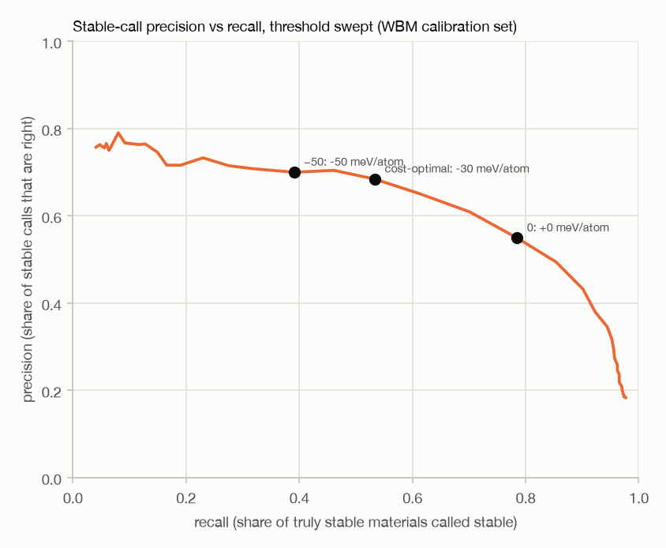

# Validation report — MACE-MP-0 medium

Generated 2026-09-12 04:36 UTC · commit `77af7bd` · settings tag `207ccc81` · model `2023-12-03-mace-128-L1_epoch-199.model` · cpu/float64 · Apple M4 Max · macOS 26.6.2

Relaxation: FrechetCellFilter + BFGS, fmax 0.01 eV/Å, |stress| ≤ 0.01 GPa, ≤ 500 steps, fallback ladder on failure. Bins: energy above hull (eV/atom) — MP targets on the GGA/GGA+U hull, WBM against the MP hull (with a '<0' bin). Brackets: 95 % bootstrap intervals; verdicts from the pessimistic end.

## Verdict in plain language

* **Engine evaluated:** MACE-MP-0 medium (`mace-mp-0-medium`, cpu/float64). Engines are compared on identical structures in `reports/phase3/screening.md`; candidates, licences and measured speed in `reports/phase3/candidates.md`. All statements below use the pessimistic end of the 95 % interval.
* **Threshold:** call a new material stable when its predicted energy above hull is ≤ -30 meV/atom (cost-optimal on the calibration set at the placeholder costs). At that threshold **at least 64% of 'stable' calls are right** (point 68%) and at least 49% of truly stable materials are found (point 53%); 'unstable' calls are right at least 91.0% of the time. Precision verdict: use with caution.
* **Energy error on new materials, upper bound by true hull distance:** <0: ≤ 46 meV/atom (use with caution); 0–0.025: ≤ 30 meV/atom (use with caution); 0.025–0.1: ≤ 45 meV/atom (use with caution); 0.1–0.3: ≤ 103 meV/atom (not trustworthy); >0.3: ≤ 136 meV/atom (not trustworthy).
* **Relaxation changes the structure** for 7% (<0), 5% (0–0.025), 7% (0.025–0.1), 12% (0.1–0.3), 18% (>0.3) of new materials; those results carry 3.0× the energy error of the rest (158 vs 52 meV/atom MAE) and should go to DFT, not to the lab.
* **Known materials that keep their structure, energy error upper bound (meV/atom):** ≤0.025: ≤ 15 (trustworthy); 0.025–0.1: ≤ 17 (trustworthy); 0.1–0.3: ≤ 27 (trustworthy); >0.3: ≤ 143 (not trustworthy).
* **Chemistries (new materials, ≥ 20 compounds):** error upper bound ≤ 30 meV/atom for no element; error lower bound > 60 meV/atom (not trustworthy) for Pu, Np, Ta, H, U.
* **Hull construction for new materials:** relaxing every competing phase with the engine makes the hull-distance error **larger** by +5.1 [+1.7, +8.8] meV/atom per system than placing the engine's energy on the MP DFT hull (mode a). On new materials the error belongs to the new structure and does not cancel against the competitors; mode (a) is the better construction for the product, and it needs no competitor relaxations.
* **The locked WBM test set is reported separately in `reports/final_test.md`** (opened once, every threshold fitted on this calibration set).

### Compared with the previous scorecard

Previous: `mace-mpa-0-medium` (settings `c2480e74`). **Settings differ.**

| metric                                                |   previous |   this run |
|:------------------------------------------------------|-----------:|-----------:|
| mp_same_structure_energy_mae_≤0.025                   |      6.498 |     12.701 |
| mp_same_structure_energy_mae_upper_≤0.025             |      7.355 |     15.240 |
| mp_same_structure_energy_mae_0.025–0.1                |      9.370 |     15.218 |
| mp_same_structure_energy_mae_upper_0.025–0.1          |     10.382 |     16.737 |
| mp_same_structure_energy_mae_0.1–0.3                  |     19.532 |     23.881 |
| mp_same_structure_energy_mae_upper_0.1–0.3            |     22.606 |     26.829 |
| mp_same_structure_energy_mae_>0.3                     |    109.773 |    119.598 |
| mp_same_structure_energy_mae_upper_>0.3               |    134.836 |    142.631 |
| wbm_energy_mae_<0                                     |     14.754 |     40.212 |
| wbm_energy_mae_upper_<0                               |     17.221 |     46.366 |
| wbm_energy_mae_0–0.025                                |     11.012 |     25.960 |
| wbm_energy_mae_upper_0–0.025                          |     12.346 |     30.458 |
| wbm_energy_mae_0.025–0.1                              |     16.491 |     41.863 |
| wbm_energy_mae_upper_0.025–0.1                        |     18.657 |     45.303 |
| wbm_energy_mae_0.1–0.3                                |     28.026 |     77.556 |
| wbm_energy_mae_upper_0.1–0.3                          |     30.150 |    103.457 |
| wbm_energy_mae_>0.3                                   |     84.332 |    124.278 |
| wbm_energy_mae_upper_>0.3                             |     96.679 |    135.925 |
| wbm_precision_opt                                     |      0.826 |      0.684 |
| wbm_precision_opt_lower                               |      0.795 |      0.642 |
| wbm_recall_opt                                        |      0.838 |      0.534 |
| wbm_f1_opt                                            |      0.832 |      0.600 |
| wbm_npv_opt                                           |      0.971 |      0.919 |
| wbm_threshold_opt_mev                                 |      0.000 |    -30.000 |
| wbm_f1_0                                              |      0.832 |      0.646 |
| wbm_precision_0                                       |      0.826 |      0.549 |
| wbm_daf_0                                             |      5.411 |      3.603 |
| mode_b_minus_a_abs_mev                                |      1.927 |      5.081 |
| mode_b_mae_<0                                         |     16.232 |     39.552 |
| mode_b_mae_0–0.025                                    |     10.594 |     29.514 |
| mode_b_mae_0.025–0.1                                  |     13.120 |     44.036 |
| mode_b_mae_0.1–0.3                                    |     40.393 |     76.714 |
| mode_b_mae_>0.3                                       |     99.032 |    124.636 |
| routing_n                                             |   3998.000 |   3994.000 |
| routing_likely stable                                 |    103.000 |      0.000 |
| routing_likely unstable                               |   2162.000 |   1486.000 |
| routing_send to DFT                                   |   1733.000 |   2508.000 |
| routing_precision of 'likely stable'                  |      0.971 |    nan     |
| routing_NPV of 'likely unstable'                      |      0.985 |      0.978 |
| routing_share sent to DFT                             |      0.433 |      0.628 |
| routing_truly stable found as 'likely stable'         |      0.164 |      0.000 |
| routing_truly stable sent to DFT                      |      0.784 |      0.947 |
| routing_truly stable wrongly called 'likely unstable' |      0.052 |      0.053 |

## 1. What was scored, and what was not

* **WBM split** (`data/wbm_split.json`, seed 20260911, made 2026-09-11 before any tuning): calibration 4,000 ids, locked test 4,000 ids (sha256 `31f0ad698a2c…`), both in the pool's hull-bin proportions. **Every stability decision, threshold and cost optimum below uses the calibration set only. The test set has not been run; it is evaluated once, at the very end.**
* WBM calibration: 3,994 usable relaxations, 6 rejected by the convergence / sanity guard (counted, not scored), 0 without a result yet.
* **MP substitution pairs:** 1,952 pairs sampled per target hull bin (design: {"per_bin": 500, "implausible_frac": 0.1, "metallic_frac": 0.3, "max_per_prototype": 5}); sampling shortfalls (cell ran out of candidates under the prototype cap): {'>0.3': {'metallic/plausible': 48}}.

Results rejected by the guard (not converged or unphysical), per bin — excluded from every statistic:

| bin       |   pairs |   ctrl rejected |   no usable substitution start |
|:----------|--------:|----------------:|-------------------------------:|
| ≤0.025    |     500 |               0 |                              0 |
| 0.025–0.1 |     500 |               0 |                              0 |
| 0.1–0.3   |     500 |               0 |                              0 |
| >0.3      |     452 |               2 |                              3 |

Failed or timed-out jobs at this settings tag: 7 ({'mode_b': 3, 'stability': 3, 'substitution_auto': 1}).

## 2. Known materials (Materials Project substitution pairs), by target hull distance

Energies in meV/atom against MP's uncorrected PBE/PBE+U energy; volume in % against the PBE cell. *Same structure* = the relaxed result still matches the MP target (StructureMatcher, default tolerances); *relaxed into a different structure* is a different failure and is never mixed into the first.

**MP target relaxed with MACE (control):**

| bin       | ctrl outcome                       |   n | energy MAE           | energy median |err|   | mean signed             | volume MAE %         | volume median %     | energy verdict (pessimistic)   |
|:----------|:-----------------------------------|----:|:---------------------|:----------------------|:------------------------|:---------------------|:--------------------|:-------------------------------|
| ≤0.025    | relaxed into a different structure |  10 | 20.3 [7.6, 36.9]     | 13.6 [2.1, 26.9]      | -16.6 [-34.3, -1.6]     | 6.37 [1.91, 12.30]   | 3.43 [0.10, 12.41]  | use with caution               |
| ≤0.025    | same structure                     | 490 | 12.7 [10.9, 15.2]    | 7.3 [6.4, 8.0]        | +5.6 [+3.6, +8.3]       | 1.08 [0.79, 1.50]    | 0.43 [0.37, 0.49]   | trustworthy                    |
| 0.025–0.1 | relaxed into a different structure |  39 | 23.9 [19.4, 28.4]    | 22.2 [18.5, 26.9]     | -21.6 [-27.0, -15.9]    | 8.97 [5.31, 12.91]   | 2.80 [1.37, 7.58]   | trustworthy                    |
| 0.025–0.1 | same structure                     | 461 | 15.2 [13.7, 16.7]    | 10.0 [8.8, 11.2]      | -3.3 [-5.3, -1.3]       | 1.13 [0.96, 1.32]    | 0.56 [0.49, 0.63]   | trustworthy                    |
| 0.1–0.3   | relaxed into a different structure |  75 | 68.7 [56.3, 83.1]    | 53.5 [41.8, 73.3]     | -63.4 [-79.6, -50.0]    | 10.29 [4.62, 20.02]  | 3.22 [2.15, 5.32]   | not trustworthy                |
| 0.1–0.3   | same structure                     | 425 | 23.9 [21.0, 26.8]    | 12.1 [10.5, 14.5]     | -13.0 [-16.5, -9.5]     | 1.86 [1.59, 2.13]    | 0.86 [0.71, 1.06]   | trustworthy                    |
| >0.3      | relaxed into a different structure | 135 | 535.2 [401.5, 682.2] | 201.7 [164.5, 295.9]  | -532.5 [-680.2, -398.5] | 22.55 [15.83, 31.36] | 12.10 [7.92, 14.71] | not trustworthy                |
| >0.3      | same structure                     | 315 | 119.6 [96.3, 142.6]  | 38.9 [30.3, 46.4]     | -105.1 [-129.0, -80.9]  | 4.23 [3.40, 5.19]    | 1.31 [1.10, 1.71]   | not trustworthy                |

**Substituted parent relaxed — best of two starts (the product's use case):**

| bin       | sub best outcome                   |   n | energy MAE            | energy median |err|   | mean signed             | volume MAE %         | volume median %     | energy verdict (pessimistic)   |
|:----------|:-----------------------------------|----:|:----------------------|:----------------------|:------------------------|:---------------------|:--------------------|:-------------------------------|
| ≤0.025    | relaxed into a different structure |  12 | 35.4 [8.8, 74.1]      | 13.6 [2.2, 30.8]      | +4.4 [-28.0, +49.2]     | 6.47 [2.53, 11.49]   | 3.41 [0.10, 12.37]  | not trustworthy                |
| ≤0.025    | same structure                     | 488 | 2322.0 [11.2, 6941.9] | 7.3 [6.5, 8.0]        | -2303.7 [-6923.9, +7.5] | 1.27 [0.84, 1.87]    | 0.44 [0.36, 0.50]   | not trustworthy                |
| 0.025–0.1 | relaxed into a different structure |  53 | 33.4 [22.8, 49.7]     | 25.2 [19.2, 28.3]     | -6.8 [-19.6, +11.6]     | 8.69 [5.99, 11.68]   | 4.37 [2.09, 9.78]   | use with caution               |
| 0.025–0.1 | same structure                     | 447 | 15.3 [13.7, 17.0]     | 10.1 [8.8, 11.4]      | -3.5 [-5.7, -1.4]       | 1.11 [0.96, 1.29]    | 0.53 [0.47, 0.62]   | trustworthy                    |
| 0.1–0.3   | relaxed into a different structure |  94 | 62.7 [51.8, 73.9]     | 50.4 [40.2, 59.7]     | -54.7 [-67.0, -42.7]    | 11.60 [5.33, 22.45]  | 3.29 [2.17, 4.79]   | not trustworthy                |
| 0.1–0.3   | same structure                     | 406 | 24.9 [21.8, 28.3]     | 12.7 [10.9, 15.1]     | -14.1 [-18.0, -10.3]    | 1.87 [1.59, 2.16]    | 0.85 [0.70, 1.04]   | trustworthy                    |
| >0.3      | relaxed into a different structure | 154 | 515.4 [390.8, 653.2]  | 212.5 [164.8, 267.0]  | -508.6 [-648.2, -383.4] | 20.41 [15.63, 26.29] | 10.03 [7.10, 11.98] | not trustworthy                |
| >0.3      | same structure                     | 295 | 123.6 [99.0, 150.6]   | 39.3 [32.3, 46.4]     | -109.1 [-137.7, -83.4]  | 5.54 [4.36, 6.79]    | 1.63 [1.25, 2.17]   | not trustworthy                |

**Single point at the PBE structure** (model energy error with no relaxation in the way):

| bin       |   n | energy MAE         | energy median |err|   | mean signed          | energy verdict (pessimistic)   |
|:----------|----:|:-------------------|:----------------------|:---------------------|:-------------------------------|
| ≤0.025    | 500 | 13.1 [11.2, 15.6]  | 7.8 [7.0, 8.7]        | +7.8 [+5.7, +10.5]   | trustworthy                    |
| 0.025–0.1 | 500 | 14.4 [13.0, 15.9]  | 10.0 [8.4, 10.9]      | +0.5 [-1.5, +2.3]    | trustworthy                    |
| 0.1–0.3   | 500 | 18.7 [16.5, 20.9]  | 10.4 [9.0, 11.6]      | -2.3 [-5.1, +0.3]    | trustworthy                    |
| >0.3      | 452 | 86.1 [71.0, 101.7] | 28.6 [24.3, 34.8]     | -61.5 [-78.8, -45.8] | not trustworthy                |

**By chemistry class and swap plausibility** (substituted parent, best start):

| bin       | stratum          |   n | energy MAE            | energy median |err|   | stays in target structure   |
|:----------|:-----------------|----:|:----------------------|:----------------------|:----------------------------|
| ≤0.025    | metallic         | 150 | 12.8 [8.7, 20.0]      | 6.7 [5.7, 7.9]        | 98%                         |
| ≤0.025    | compound         | 350 | 3233.2 [12.1, 9674.2] | 7.7 [6.6, 8.9]        | 97%                         |
| ≤0.025    | plausible swap   | 450 | 2517.4 [11.6, 7527.3] | 7.4 [6.4, 8.2]        | 98%                         |
| ≤0.025    | implausible swap |  50 | 14.7 [8.5, 24.6]      | 7.1 [4.6, 10.5]       | 96%                         |
| 0.025–0.1 | metallic         | 150 | 17.1 [14.2, 20.0]     | 10.5 [9.1, 14.7]      | 93%                         |
| 0.025–0.1 | compound         | 350 | 17.3 [14.9, 20.3]     | 10.9 [9.4, 12.2]      | 88%                         |
| 0.025–0.1 | plausible swap   | 450 | 16.4 [14.8, 18.0]     | 10.8 [9.9, 12.3]      | 89%                         |
| 0.025–0.1 | implausible swap |  50 | 24.7 [13.1, 41.4]     | 10.7 [5.8, 14.6]      | 90%                         |
| 0.1–0.3   | metallic         | 150 | 38.8 [31.8, 46.3]     | 21.0 [17.6, 27.0]     | 80%                         |
| 0.1–0.3   | compound         | 350 | 29.2 [25.3, 33.1]     | 14.5 [12.1, 17.3]     | 82%                         |
| 0.1–0.3   | plausible swap   | 450 | 32.0 [28.2, 35.9]     | 16.5 [13.1, 19.5]     | 80%                         |
| 0.1–0.3   | implausible swap |  50 | 32.1 [23.6, 42.1]     | 18.9 [13.9, 27.6]     | 88%                         |
| >0.3      | metallic         | 101 | 186.9 [138.8, 242.2]  | 68.8 [46.4, 99.8]     | 89%                         |
| >0.3      | compound         | 348 | 278.6 [218.1, 344.7]  | 61.6 [48.0, 80.6]     | 58%                         |
| >0.3      | plausible swap   | 399 | 279.3 [227.7, 338.4]  | 68.6 [53.0, 84.7]     | 65%                         |
| >0.3      | implausible swap |  50 | 87.8 [55.7, 127.3]    | 38.6 [21.7, 70.7]     | 68%                         |

## 3. New materials (WBM calibration set), by hull distance against the MP hull

Energy error MACE − DFT (meV/atom, uncorrected), relaxed from WBM's unrelaxed structure:

| bin       | outcome                            |    n | energy MAE           | energy median |err|   | mean signed            | energy verdict (pessimistic)   |
|:----------|:-----------------------------------|-----:|:---------------------|:----------------------|:-----------------------|:-------------------------------|
| <0        | relaxed into a different structure |   42 | 108.0 [72.4, 148.6]  | 51.1 [43.9, 85.7]     | +26.5 [-18.4, +79.5]   | not trustworthy                |
| <0        | same structure                     |  567 | 35.2 [30.2, 41.1]    | 19.0 [17.2, 20.9]     | +5.1 [-0.6, +11.5]     | use with caution               |
| 0–0.025   | relaxed into a different structure |   21 | 52.9 [25.3, 88.5]    | 21.2 [11.6, 45.8]     | +9.7 [-25.8, +51.7]    | not trustworthy                |
| 0–0.025   | same structure                     |  395 | 24.5 [21.0, 28.8]    | 14.1 [12.5, 16.4]     | -2.1 [-6.7, +2.6]      | trustworthy                    |
| 0.025–0.1 | relaxed into a different structure |   77 | 89.8 [61.9, 123.7]   | 43.1 [35.4, 53.2]     | -18.5 [-57.7, +16.3]   | not trustworthy                |
| 0.025–0.1 | same structure                     | 1041 | 38.3 [35.7, 41.0]    | 25.0 [22.8, 27.7]     | -20.4 [-23.7, -17.0]   | use with caution               |
| 0.1–0.3   | relaxed into a different structure |  157 | 194.9 [86.1, 401.3]  | 81.4 [68.4, 100.6]    | -146.1 [-354.3, -32.5] | not trustworthy                |
| 0.1–0.3   | same structure                     | 1176 | 61.9 [58.3, 65.7]    | 46.0 [43.2, 48.7]     | -41.4 [-45.8, -37.1]   | not trustworthy                |
| >0.3      | relaxed into a different structure |   92 | 199.1 [161.5, 240.5] | 141.8 [108.4, 188.0]  | -137.9 [-186.6, -89.1] | not trustworthy                |
| >0.3      | same structure                     |  426 | 108.1 [98.2, 118.4]  | 72.8 [67.0, 83.1]     | -78.2 [-90.9, -65.7]   | not trustworthy                |

Single point at WBM's DFT-relaxed structure:

| bin       |    n | energy MAE         | energy median |err|   | mean signed          | energy verdict (pessimistic)   |
|:----------|-----:|:-------------------|:----------------------|:---------------------|:-------------------------------|
| <0        |  609 | 40.7 [34.5, 47.5]  | 19.2 [17.1, 21.7]     | +17.1 [+10.2, +24.4] | use with caution               |
| 0–0.025   |  416 | 25.2 [21.7, 29.6]  | 13.6 [12.9, 16.2]     | +4.4 [-0.0, +9.2]    | trustworthy                    |
| 0.025–0.1 | 1118 | 37.5 [34.6, 40.6]  | 23.1 [20.9, 25.0]     | -10.1 [-13.8, -6.5]  | use with caution               |
| 0.1–0.3   | 1333 | 55.5 [52.6, 58.6]  | 41.6 [37.9, 44.5]     | -26.8 [-30.8, -22.7] | use with caution               |
| >0.3      |  518 | 95.8 [87.7, 104.2] | 67.6 [59.5, 75.8]     | -47.8 [-59.1, -36.8] | not trustworthy                |

## 4. Stability decisions on new materials (WBM calibration set only)

Positive class = stable (reference energy above the MP hull ≤ 0). A material is called stable when its predicted hull distance (DFT hull distance + MACE − DFT energy, the Matbench Discovery construction) is ≤ the decision threshold. NPV = how often an 'unstable' call is right; DAF = precision ÷ share of stable materials. Intervals: 95 % bootstrap; **the verdict column uses the lower bound.**

Share of stable materials in the calibration set: 0.152 (n=3,994).

| threshold                          |   called stable | precision         | recall            | F1                | NPV                  | DAF               | precision verdict (lower bound)   |
|:-----------------------------------|----------------:|:------------------|:------------------|:------------------|:---------------------|:------------------|:----------------------------------|
| +0 meV/atom (on-hull)              |             870 | 0.55 [0.52, 0.58] | 0.78 [0.75, 0.82] | 0.65 [0.62, 0.67] | 0.958 [0.951, 0.965] | 3.60 [3.40, 3.82] | not trustworthy                   |
| -30 meV/atom (cost-optimal)        |             475 | 0.68 [0.64, 0.73] | 0.53 [0.49, 0.57] | 0.60 [0.56, 0.63] | 0.919 [0.910, 0.928] | 4.49 [4.19, 4.81] | use with caution                  |
| −50 meV/atom (round-1 exploration) |             340 | 0.70 [0.65, 0.75] | 0.39 [0.35, 0.43] | 0.50 [0.46, 0.54] | 0.898 [0.889, 0.908] | 4.59 [4.24, 4.97] | use with caution                  |

**Cost-based operating point.** Costs from `config/costs.json`: wasted lab test = 1.0, missed stable material = 1.0 (**placeholders — set real numbers**). Expected cost per screened candidate = (false positives × wasted-test cost + false negatives × missed-material cost) ÷ N, minimised over the threshold sweep. How the optimum moves with the cost ratio:

|   missed stable ÷ wasted lab test |   optimal threshold (meV/atom) |   precision |   recall |   expected cost per candidate |
|----------------------------------:|-------------------------------:|------------:|---------:|------------------------------:|
|                             0.250 |                       -150.000 |       0.790 |    0.080 |                         0.038 |
|                             0.500 |                        -40.000 |       0.704 |    0.461 |                         0.071 |
|                             1.000 |                        -30.000 |       0.684 |    0.534 |                         0.109 |
|                             2.000 |                        -10.000 |       0.609 |    0.701 |                         0.160 |
|                             4.000 |                         10.000 |       0.494 |    0.854 |                         0.222 |
|                            10.000 |                         20.000 |       0.432 |    0.901 |                         0.331 |

Threshold sweep (calibration set):

|   threshold |   called_stable |   tp |   fp |   fn |   precision |   recall |    f1 |   npv |   daf |
|------------:|----------------:|-----:|-----:|-----:|------------:|---------:|------:|------:|------:|
|      -0.150 |              62 |   49 |   13 |  560 |       0.790 |    0.080 | 0.146 | 0.858 | 5.183 |
|      -0.100 |             141 |  101 |   40 |  508 |       0.716 |    0.166 | 0.269 | 0.868 | 4.698 |
|      -0.050 |             340 |  238 |  102 |  371 |       0.700 |    0.391 | 0.502 | 0.898 | 4.591 |
|       0.000 |             870 |  478 |  392 |  131 |       0.549 |    0.785 | 0.646 | 0.958 | 3.603 |
|       0.050 |            1826 |  580 | 1246 |   29 |       0.318 |    0.952 | 0.476 | 0.987 | 2.083 |
|       0.100 |            2490 |  588 | 1902 |   21 |       0.236 |    0.966 | 0.379 | 0.986 | 1.549 |
|       0.150 |            2947 |  591 | 2356 |   18 |       0.201 |    0.970 | 0.332 | 0.983 | 1.315 |

**Where the calls go wrong, by TRUE hull distance** (share called stable at -30 meV/atom). Precision cannot be computed per true bin (all members share one label); this shows which unstable bins leak into 'stable' calls:

| true bin   |    n | called stable     | reads as            |
|:-----------|-----:|:------------------|:--------------------|
| <0         |  609 | 0.53 [0.49, 0.57] | recall              |
| 0–0.025    |  416 | 0.10 [0.07, 0.12] | false-positive rate |
| 0.025–0.1  | 1118 | 0.07 [0.06, 0.09] | false-positive rate |
| 0.1–0.3    | 1333 | 0.02 [0.01, 0.03] | false-positive rate |
| >0.3       |  518 | 0.01 [0.00, 0.02] | false-positive rate |

**How often a prediction is right, by PREDICTED hull distance** (the view a user has of a new candidate):

| PREDICTED bin   |    n | truly stable      |
|:----------------|-----:|:------------------|
| <0              |  870 | 0.55 [0.51, 0.58] |
| 0–0.025         |  493 | 0.15 [0.12, 0.18] |
| 0.025–0.1       | 1127 | 0.03 [0.02, 0.04] |
| 0.1–0.3         | 1110 | 0.01 [0.01, 0.02] |
| >0.3            |  394 | 0.02 [0.01, 0.04] |

## 5. Cross-check against the published Matbench Discovery numbers

Same model checkpoint, same hull-distance construction, threshold 0. Published: Matbench Discovery, models/mace/mace-mp-0.yml (unique-prototype subset); their relaxation: FIRE, fmax 0.05 eV/Å, ≤ 500 steps, FrechetCellFilter. Ours: BFGS + FrechetCellFilter, fmax 0.01 eV/Å **and** |stress| ≤ 0.01 GPa, fallback ladder on failure.

| metric         |   Matbench Discovery (published) |   this harness (calibration set) | 95 % CI              | published value inside CI   |
|:---------------|---------------------------------:|---------------------------------:|:---------------------|:----------------------------|
| F1             |                            0.669 |                            0.646 | 0.646 [0.617, 0.674] | yes                         |
| DAF            |                            3.777 |                            3.603 | 3.603 [3.403, 3.821] | yes                         |
| precision      |                            0.577 |                            0.549 | 0.549 [0.516, 0.581] | yes                         |
| recall         |                            0.796 |                            0.785 | 0.785 [0.752, 0.816] | yes                         |
| accuracy       |                            0.878 |                            0.869 | 0.869 [0.858, 0.880] | yes                         |
| MAE (eV/atom)  |                            0.057 |                            0.063 | 0.063 [0.057, 0.072] | yes                         |
| RMSE (eV/atom) |                            0.101 |                            0.269 |                      |                             |
| R2             |                            0.697 |                           -1.310 |                      |                             |

Where a published value lies outside our interval, the likely reasons are, in order: (1) our tighter relaxation (5× smaller force tolerance plus an explicit stress criterion) lets structures relax further, which lowers energies of high-energy structures and moves borderline calls; (2) sampling — ours is a 4,000-structure calibration set, theirs the full 215,488; (3) guard-rejected structures are excluded here and counted above.

## 6. Curated stability gate: mode (a) vs mode (b)

50 curated known materials (all within 0.3 eV/atom of the hull). Mode (b) is not scored when one of the MP reference hull's own phases has no usable MACE relaxation (MACE-MP-0 collapses solid O₂, the oxygen corner of every oxide hull here). Mode (b) on new materials is Phase 4.

| mode                                         |   scored |   unscored |   e_hull MAE meV/atom |   accuracy@0 |   accuracy@0.1 |
|:---------------------------------------------|---------:|-----------:|----------------------:|-------------:|---------------:|
| a (MACE target, DFT competitors)             |       50 |          0 |                15.448 |        0.680 |          0.940 |
| b (every phase MACE, strict)                 |       27 |         23 |                 3.849 |        0.852 |          1.000 |
| b + stand-in polymorph (flagged, not mode b) |       50 |          0 |                 4.352 |        0.860 |          1.000 |

## 6b. New materials in mode (b): every competing phase relaxed with the engine

297 WBM calibration systems (data/mode_b_sample.json: a fixed number per hull bin, one structure per chemical system). Reference = WBM DFT entry on the current MP GGA/GGA+U hull, MP2020 re-applied to every entry with this pymatgen (so it differs slightly from WBM's shipped hull distance). Mode (a): engine-relaxed target vs MP DFT phases. Mode (b): engine-relaxed target vs engine-relaxed MP phases within 0.1 eV/atom of the MP hull, against the reference on the same phases. Errors in meV/atom.

Status of the mode (b) hulls: complete: 265, not scored: reference hull phase missing: 31, scored: off-hull phases missing: 1.

| bin (reference)   |   systems | mode (a) MAE        | mode (a) median   |   mode (b) scored | mode (b) MAE        | mode (b) median    |   stand-in only (flagged) | mode (b) verdict (upper bound)   |
|:------------------|----------:|:--------------------|:------------------|------------------:|:--------------------|:-------------------|--------------------------:|:---------------------------------|
| <0                |        58 | 40.1 [26.3, 56.4]   | 20.3 [14.4, 26.6] |                55 | 39.6 [26.4, 56.4]   | 18.9 [13.4, 24.6]  |                         3 | use with caution                 |
| 0–0.025           |        57 | 26.8 [18.2, 36.5]   | 13.8 [9.7, 21.9]  |                54 | 29.5 [19.5, 42.5]   | 15.4 [7.8, 24.6]   |                         3 | use with caution                 |
| 0.025–0.1         |        61 | 39.8 [28.0, 52.9]   | 22.5 [14.0, 30.7] |                55 | 44.0 [32.4, 57.7]   | 27.5 [17.4, 44.8]  |                         5 | use with caution                 |
| 0.1–0.3           |        62 | 68.5 [52.5, 86.0]   | 48.1 [38.3, 69.4] |                54 | 76.7 [58.1, 98.4]   | 60.3 [41.5, 83.8]  |                         8 | not trustworthy                  |
| >0.3              |        59 | 106.3 [81.5, 134.1] | 79.4 [57.5, 98.1] |                48 | 124.6 [94.0, 159.0] | 90.2 [47.3, 134.6] |                        11 | not trustworthy                  |

Stable calls at 0 eV/atom on these systems (the sample over-represents stable materials by design — one bin in five is '<0' — so precision here is not the population precision of section 4):

| mode   |   scored | precision         | recall            | F1                | NPV                  |
|:-------|---------:|:------------------|:------------------|:------------------|:---------------------|
| a      |      297 | 0.57 [0.45, 0.67] | 0.78 [0.66, 0.88] | 0.66 [0.55, 0.74] | 0.940 [0.906, 0.971] |
| b      |      266 | 0.54 [0.43, 0.65] | 0.80 [0.69, 0.91] | 0.65 [0.54, 0.74] | 0.941 [0.907, 0.974] |

**Paired comparison** on systems scored in both modes (meV/atom; positive = mode (b) worse):

| bin       |   systems scored in both | |b| − |a| mean      | mode (b) closer   |   mean signed a |   mean signed b |
|:----------|-------------------------:|:--------------------|:------------------|----------------:|----------------:|
| <0        |                       55 | -0.2 [-6.5, +5.1]   | 45%               |             3.7 |            -3.1 |
| 0–0.025   |                       54 | +2.0 [-1.8, +6.5]   | 48%               |           -11.3 |           -14.3 |
| 0.025–0.1 |                       55 | +2.1 [-5.1, +8.6]   | 42%               |           -17.7 |           -26.3 |
| 0.1–0.3   |                       54 | +7.6 [+2.3, +13.4]  | 37%               |           -29.9 |           -38.8 |
| >0.3      |                       48 | +15.3 [+2.0, +31.3] | 42%               |           -59.6 |           -89.6 |
| all       |                      266 | +5.1 [+1.7, +8.8]   | 43%               |           -22.0 |           -33.0 |

## 6c. Confidence and routing (calibration set, 5-fold cross-validated)

Mondrian split-conformal bounds for the true hull distance, each one-sided at 90% (a 'stable' call uses only the upper bound, an 'unstable' call only the lower bound); groups = chemistry family × predicted hull bin (fallback to family, then all, below 40 members). Chosen over isotonic calibration because it guarantees coverage per group without assuming a monotone, well-behaved error — this model's error is biased and heavy-tailed (see `harness/confidence.py`). Coverage measured on held-out folds (targets: each bound ≥ 0.90, interval ≥ 0.80):

| family        |        n |   upper bound holds |   lower bound holds |   interval holds |   median width (eV/atom) |
|:--------------|---------:|--------------------:|--------------------:|-----------------:|-------------------------:|
| chalcogenide  |  260.000 |               0.900 |               0.877 |            0.777 |                    0.144 |
| f-electron    | 2033.000 |               0.902 |               0.902 |            0.804 |                    0.158 |
| halide        |  195.000 |               0.903 |               0.908 |            0.810 |                    0.195 |
| intermetallic |  733.000 |               0.899 |               0.902 |            0.801 |                    0.147 |
| other         |  299.000 |               0.896 |               0.893 |            0.789 |                    0.171 |
| oxide         |  235.000 |               0.898 |               0.911 |            0.809 |                    0.127 |
| pnictide      |  239.000 |               0.912 |               0.908 |            0.820 |                    0.180 |
| all           | 3994.000 |               0.901 |               0.901 |            0.802 |                    0.158 |

**Why the labels do not come from these bounds.** Routing on them was tried first: the bounds hold ~90 % of the time per group, yet only 73% of the candidates whose upper bound fell below 0 were truly stable — marginal coverage does not control the error rate among the candidates a rule selects. The labels therefore use per-family thresholds certified directly on that quantity (Learn-then-Test style): the loosest threshold whose 'stable' calls have precision ≥ 90%, and the most inclusive whose 'unstable' calls have NPV ≥ 95%, each with a one-sided Clopper–Pearson bound at 95% confidence, Bonferroni-corrected over the 61-point threshold grid. Families with fewer than 100 labelable calibration structures get no label (DFT).

Each held-out structure gets one label from rules fitted on the other folds: 'send to DFT' if it contains a known-weak element (MAE lower bound > 60 meV/atom, or fewer than 20 calibration compounds), if its relaxation left the starting structure, or if its prediction lies between the certified thresholds; otherwise 'likely stable' / 'likely unstable'. The second engine's disagreement signal is added once a second engine has run.

| quantity                                      |   certified thresholds (used) |   conformal bounds (rejected) |
|:----------------------------------------------|------------------------------:|------------------------------:|
| n                                             |                      3994.000 |                      3994.000 |
| likely stable                                 |                         0.000 |                        45.000 |
| likely unstable                               |                      1486.000 |                      2007.000 |
| send to DFT                                   |                      2508.000 |                      1942.000 |
| precision of 'likely stable'                  |                       nan     |                         0.733 |
| NPV of 'likely unstable'                      |                         0.978 |                         0.986 |
| share sent to DFT                             |                         0.628 |                         0.486 |
| truly stable found as 'likely stable'         |                         0.000 |                         0.054 |
| truly stable sent to DFT                      |                         0.947 |                         0.898 |
| truly stable wrongly called 'likely unstable' |                         0.053 |                         0.048 |

Certified thresholds fitted on the whole calibration set (what the product would use): chalcogenide: stable ≤ —, unstable > — meV/atom (n=216); f-electron: stable ≤ —, unstable > +10 meV/atom (n=1530); halide: stable ≤ —, unstable > — meV/atom (n=151); intermetallic: stable ≤ —, unstable > +10 meV/atom (n=602); other: stable ≤ —, unstable > +20 meV/atom (n=206); oxide: stable ≤ —, unstable > — meV/atom (n=185); pnictide: stable ≤ —, unstable > — meV/atom (n=194); weak elements: Be, H, Np, Os, Pm, Pu, Ta, Tc, U.

Why candidates were sent to DFT (a candidate can have several reasons): low confidence: between the certified thresholds: 1964, known-weak chemistry: 559, relaxation changed the structure: 423, low confidence: no certified thresholds for family 'halide': 43.

**How often a plain threshold-0 call is right, by chemistry family and predicted hull distance** (observed on the calibration set; the product shows this next to every prediction):

| family        | predicted bin   |   n | call     | call right        |
|:--------------|:----------------|----:|:---------|:------------------|
| chalcogenide  | 0.025–0.1       |  88 | unstable | 0.99 [0.95, 1.00] |
| chalcogenide  | 0.1–0.3         |  57 | unstable | 1.00 [1.00, 1.00] |
| chalcogenide  | 0–0.025         |  31 | unstable | 0.81 [0.65, 0.94] |
| chalcogenide  | <0              |  61 | stable   | 0.56 [0.44, 0.67] |
| chalcogenide  | >0.3            |  23 | unstable | 1.00 [1.00, 1.00] |
| f-electron    | 0.025–0.1       | 539 | unstable | 0.96 [0.95, 0.98] |
| f-electron    | 0.1–0.3         | 519 | unstable | 0.98 [0.96, 0.99] |
| f-electron    | 0–0.025         | 265 | unstable | 0.84 [0.79, 0.88] |
| f-electron    | <0              | 521 | stable   | 0.56 [0.51, 0.59] |
| f-electron    | >0.3            | 189 | unstable | 0.96 [0.93, 0.98] |
| halide        | 0.025–0.1       |  53 | unstable | 0.96 [0.91, 1.00] |
| halide        | 0.1–0.3         |  27 | unstable | 1.00 [1.00, 1.00] |
| halide        | 0–0.025         |  40 | unstable | 0.85 [0.72, 0.95] |
| halide        | <0              |  72 | stable   | 0.61 [0.50, 0.72] |
| halide        | >0.3            |   3 | unstable | 1.00 [1.00, 1.00] |
| intermetallic | 0.025–0.1       | 223 | unstable | 0.97 [0.95, 0.99] |
| intermetallic | 0.1–0.3         | 234 | unstable | 1.00 [1.00, 1.00] |
| intermetallic | 0–0.025         |  73 | unstable | 0.90 [0.84, 0.96] |
| intermetallic | <0              | 105 | stable   | 0.41 [0.32, 0.50] |
| intermetallic | >0.3            |  98 | unstable | 1.00 [1.00, 1.00] |
| other         | 0.025–0.1       |  80 | unstable | 1.00 [1.00, 1.00] |
| other         | 0.1–0.3         | 113 | unstable | 1.00 [1.00, 1.00] |
| other         | 0–0.025         |  31 | unstable | 0.77 [0.61, 0.90] |
| other         | <0              |  45 | stable   | 0.60 [0.47, 0.74] |
| other         | >0.3            |  30 | unstable | 1.00 [1.00, 1.00] |
| oxide         | 0.025–0.1       |  76 | unstable | 0.96 [0.91, 1.00] |
| oxide         | 0.1–0.3         |  75 | unstable | 0.99 [0.96, 1.00] |
| oxide         | 0–0.025         |  23 | unstable | 0.87 [0.74, 1.00] |
| oxide         | <0              |  29 | stable   | 0.66 [0.48, 0.83] |
| oxide         | >0.3            |  32 | unstable | 1.00 [1.00, 1.00] |
| pnictide      | 0.025–0.1       |  68 | unstable | 0.96 [0.91, 1.00] |
| pnictide      | 0.1–0.3         |  85 | unstable | 1.00 [1.00, 1.00] |
| pnictide      | 0–0.025         |  30 | unstable | 0.87 [0.73, 0.97] |
| pnictide      | <0              |  37 | stable   | 0.54 [0.38, 0.70] |
| pnictide      | >0.3            |  19 | unstable | 1.00 [1.00, 1.00] |

## 7. Errors by element and by magnetism

Error attributed to every element of a compound; elements in fewer than 20 compounds are counted, not shown. Sorted by the upper bound of the MAE.

**New materials (WBM calibration, relaxed energy):** 81 elements shown, 3 below the minimum count.

| element   |   n | MAE meV/atom         | mean signed            | verdict (upper bound)   |
|:----------|----:|:---------------------|:-----------------------|:------------------------|
| Pu        | 100 | 377.7 [194.2, 712.0] | -49.2 [-397.0, +147.8] | not trustworthy         |
| Mn        | 242 | 131.6 [58.0, 268.1]  | -99.5 [-237.5, -25.5]  | not trustworthy         |
| Zn        | 221 | 119.7 [42.5, 267.4]  | -102.5 [-251.8, -24.1] | not trustworthy         |
| Pa        |  23 | 97.7 [46.0, 184.0]   | -44.3 [-140.7, +18.4]  | not trustworthy         |
| Np        |  74 | 92.6 [71.8, 115.6]   | -23.7 [-53.4, +5.0]    | not trustworthy         |
| Ta        |  92 | 91.8 [73.2, 113.5]   | -72.1 [-97.0, -49.6]   | not trustworthy         |
| Re        |  24 | 62.0 [32.3, 102.2]   | -18.1 [-57.0, +28.8]   | not trustworthy         |
| Os        |  78 | 77.8 [59.5, 101.6]   | -41.6 [-67.7, -15.5]   | not trustworthy         |
| F         | 129 | 77.8 [58.8, 100.5]   | -49.4 [-75.0, -26.3]   | not trustworthy         |
| C         | 102 | 73.5 [54.5, 97.9]    | -54.9 [-81.0, -34.3]   | not trustworthy         |
| H         |  87 | 80.0 [65.3, 95.9]    | -67.4 [-86.4, -49.5]   | not trustworthy         |
| Cl        | 101 | 75.0 [56.5, 94.9]    | -60.6 [-82.5, -40.9]   | not trustworthy         |
| Mo        |  40 | 65.2 [41.1, 94.6]    | -46.3 [-78.9, -17.9]   | not trustworthy         |
| I         |  77 | 65.7 [44.6, 94.3]    | -53.0 [-82.4, -30.0]   | not trustworthy         |
| Cr        | 110 | 73.8 [59.9, 88.1]    | -9.8 [-28.2, +10.5]    | not trustworthy         |
| Te        | 137 | 67.9 [53.3, 87.5]    | -49.5 [-70.6, -32.4]   | not trustworthy         |
| Ir        | 173 | 70.7 [58.1, 85.8]    | -8.0 [-24.1, +11.1]    | not trustworthy         |
| Au        | 161 | 66.3 [49.7, 85.0]    | -8.9 [-28.0, +13.2]    | not trustworthy         |
| Bi        |  93 | 63.8 [46.8, 84.8]    | -28.1 [-50.7, -6.0]    | not trustworthy         |
| U         | 117 | 71.8 [60.9, 83.0]    | -45.0 [-60.4, -30.2]   | not trustworthy         |
| Pb        | 148 | 68.7 [56.3, 82.8]    | -45.7 [-62.2, -30.9]   | not trustworthy         |
| V         | 115 | 64.2 [50.0, 81.1]    | -54.8 [-72.6, -39.9]   | not trustworthy         |
| Ru        | 173 | 68.2 [55.8, 80.9]    | -44.0 [-58.5, -29.8]   | not trustworthy         |
| As        | 166 | 64.5 [52.2, 79.8]    | -40.8 [-57.3, -25.6]   | not trustworthy         |
| Rb        | 118 | 63.2 [48.9, 79.5]    | -54.4 [-71.9, -39.4]   | not trustworthy         |
| N         | 153 | 66.4 [56.4, 78.4]    | -36.0 [-50.8, -23.0]   | not trustworthy         |
| Nb        | 105 | 62.7 [50.9, 76.8]    | -41.1 [-57.2, -25.7]   | not trustworthy         |
| Ac        |  24 | 54.0 [34.3, 76.6]    | -24.0 [-51.3, +4.6]    | not trustworthy         |
| Sb        | 141 | 63.5 [52.5, 76.5]    | -42.3 [-56.8, -28.5]   | not trustworthy         |
| P         | 176 | 62.6 [51.2, 75.6]    | -39.9 [-54.1, -27.2]   | not trustworthy         |
| Ti        | 119 | 62.6 [50.3, 75.6]    | -40.3 [-55.8, -24.8]   | not trustworthy         |
| Ba        | 172 | 56.2 [41.6, 74.9]    | -39.7 [-58.8, -23.7]   | not trustworthy         |
| Th        | 133 | 64.2 [54.6, 74.7]    | -42.0 [-55.0, -29.6]   | not trustworthy         |
| Sn        | 248 | 65.7 [57.3, 74.2]    | -40.9 [-51.9, -30.4]   | not trustworthy         |
| Ge        | 267 | 63.4 [54.8, 73.1]    | -31.0 [-42.4, -19.9]   | not trustworthy         |
| Fe        | 295 | 61.5 [52.3, 72.8]    | -31.3 [-43.2, -20.1]   | not trustworthy         |
| Rh        | 250 | 62.9 [53.8, 72.8]    | -26.9 [-38.2, -14.6]   | not trustworthy         |
| W         |  35 | 50.1 [32.2, 72.7]    | -24.4 [-51.5, -0.7]    | not trustworthy         |
| Br        |  89 | 56.4 [43.1, 71.5]    | -33.8 [-52.3, -17.7]   | not trustworthy         |
| Ho        | 128 | 58.0 [46.0, 71.2]    | -42.7 [-57.8, -28.9]   | not trustworthy         |
| Tl        | 137 | 50.4 [37.0, 70.3]    | -23.9 [-44.3, -8.3]    | not trustworthy         |
| Hf        | 103 | 58.3 [47.7, 70.2]    | -33.0 [-47.7, -18.8]   | not trustworthy         |
| S         | 187 | 57.3 [46.4, 69.8]    | -37.5 [-50.1, -25.1]   | not trustworthy         |
| Co        | 237 | 59.6 [50.6, 69.8]    | -17.6 [-29.4, -5.5]    | not trustworthy         |
| Si        | 260 | 59.1 [49.4, 69.8]    | -25.4 [-36.8, -13.2]   | not trustworthy         |
| B         | 154 | 58.7 [50.8, 67.4]    | -32.4 [-44.0, -20.8]   | not trustworthy         |
| Y         | 125 | 53.5 [42.8, 66.1]    | -36.3 [-50.4, -24.1]   | not trustworthy         |
| Dy        | 123 | 54.4 [44.0, 65.9]    | -28.0 [-41.9, -14.5]   | not trustworthy         |
| Tm        | 126 | 53.0 [42.2, 65.3]    | -31.5 [-46.3, -17.9]   | not trustworthy         |
| Sc        | 128 | 53.7 [43.3, 64.8]    | -32.2 [-45.8, -18.7]   | not trustworthy         |
| Al        | 317 | 57.3 [50.0, 64.6]    | -44.2 [-52.5, -35.8]   | not trustworthy         |
| Sr        | 181 | 51.4 [40.4, 64.6]    | -25.4 [-39.4, -11.5]   | not trustworthy         |
| Er        | 122 | 50.3 [39.3, 62.9]    | -28.3 [-42.3, -14.0]   | not trustworthy         |
| Na        |  96 | 49.8 [39.7, 61.3]    | -22.3 [-36.7, -7.6]    | not trustworthy         |
| Pd        | 226 | 50.8 [42.2, 60.8]    | -23.1 [-34.2, -12.4]   | not trustworthy         |
| Li        | 140 | 48.9 [39.6, 60.7]    | -10.2 [-22.4, +4.5]    | not trustworthy         |
| Lu        |  88 | 48.5 [37.7, 60.6]    | -40.9 [-54.1, -28.4]   | not trustworthy         |
| In        | 287 | 51.2 [43.5, 59.5]    | -18.2 [-28.2, -7.8]    | use with caution        |
| Pt        | 235 | 51.4 [44.3, 58.9]    | -27.6 [-36.9, -18.0]   | use with caution        |
| Ce        | 129 | 49.2 [40.9, 58.7]    | -19.1 [-31.8, -7.2]    | use with caution        |
| Cd        | 130 | 48.1 [38.4, 58.4]    | -24.4 [-37.2, -12.5]   | use with caution        |
| Ni        | 313 | 47.8 [39.1, 58.0]    | -27.4 [-38.4, -17.5]   | use with caution        |
| Se        | 154 | 48.5 [39.5, 57.7]    | -29.2 [-40.8, -18.3]   | use with caution        |
| Ga        | 267 | 49.0 [41.4, 57.4]    | -14.3 [-23.7, -3.9]    | use with caution        |
| Cs        | 110 | 47.2 [38.1, 57.3]    | -38.1 [-49.3, -27.6]   | use with caution        |
| K         | 134 | 45.9 [36.3, 56.9]    | -31.7 [-44.1, -19.6]   | use with caution        |
| Zr        | 126 | 47.2 [39.6, 56.1]    | -30.2 [-41.3, -19.7]   | use with caution        |
| Yb        | 122 | 45.0 [35.8, 55.5]    | -17.2 [-29.6, -5.8]    | use with caution        |
| Tb        | 144 | 46.0 [37.5, 55.3]    | -31.9 [-42.3, -21.7]   | use with caution        |
| Ag        | 114 | 43.3 [34.5, 54.6]    | -25.2 [-37.9, -13.5]   | use with caution        |
| Pr        | 129 | 46.1 [37.8, 54.6]    | -27.5 [-38.2, -16.8]   | use with caution        |
| O         | 472 | 46.3 [39.6, 54.2]    | -17.7 [-26.8, -10.0]   | use with caution        |
| Eu        |  68 | 37.2 [25.7, 52.2]    | -15.6 [-32.5, -1.7]    | use with caution        |
| La        | 134 | 42.7 [35.3, 51.5]    | -22.4 [-33.4, -13.1]   | use with caution        |
| Mg        | 194 | 44.1 [37.8, 50.8]    | -30.4 [-38.6, -22.8]   | use with caution        |
| Nd        | 128 | 42.4 [34.8, 50.8]    | -19.7 [-29.5, -9.4]    | use with caution        |
| Ca        | 137 | 42.4 [35.2, 50.1]    | -24.6 [-34.0, -15.6]   | use with caution        |
| Sm        | 118 | 39.9 [31.6, 49.3]    | -20.2 [-31.4, -9.2]    | use with caution        |
| Gd        |  79 | 37.8 [29.6, 46.4]    | -21.7 [-32.9, -11.0]   | use with caution        |
| Cu        | 289 | 40.0 [34.0, 46.2]    | -26.3 [-33.6, -19.3]   | use with caution        |
| Hg        |  78 | 36.8 [28.6, 45.5]    | -19.0 [-30.0, -8.7]    | use with caution        |

**Known materials (MP pairs, control, same structure):** 68 elements shown, 16 below the minimum count.

| element   |   n | MAE meV/atom         | mean signed             | verdict (upper bound)   |
|:----------|----:|:---------------------|:------------------------|:------------------------|
| Gd        |  48 | 198.9 [129.2, 270.9] | -194.7 [-268.1, -123.5] | not trustworthy         |
| Zr        |  31 | 55.3 [15.6, 117.1]   | -44.3 [-107.5, -3.5]    | not trustworthy         |
| Ho        |  58 | 51.5 [10.0, 112.8]   | -42.7 [-104.7, -0.5]    | not trustworthy         |
| Pb        |  30 | 55.9 [19.1, 100.1]   | -41.8 [-88.3, -2.1]     | not trustworthy         |
| Mn        | 110 | 71.0 [47.0, 96.5]    | -58.1 [-84.3, -33.4]    | not trustworthy         |
| Os        |  20 | 48.0 [18.1, 96.2]    | +6.8 [-28.7, +60.4]     | not trustworthy         |
| F         |  79 | 48.3 [20.0, 95.8]    | -31.1 [-79.8, -1.6]     | not trustworthy         |
| Eu        |  25 | 38.3 [8.4, 94.5]     | -29.1 [-87.0, +3.0]     | not trustworthy         |
| Cr        |  99 | 48.4 [21.7, 89.4]    | -29.9 [-70.5, -2.3]     | not trustworthy         |
| Ru        |  33 | 39.9 [11.8, 87.5]    | -30.8 [-79.2, -1.2]     | not trustworthy         |
| V         |  90 | 43.6 [21.1, 80.1]    | -28.8 [-66.4, -4.7]     | not trustworthy         |
| Ni        | 135 | 53.2 [34.2, 76.0]    | -39.2 [-62.5, -18.8]    | not trustworthy         |
| U         |  25 | 32.5 [9.7, 72.6]     | -17.1 [-59.5, +8.4]     | not trustworthy         |
| As        |  24 | 34.4 [13.1, 71.2]    | -23.9 [-63.0, -0.4]     | not trustworthy         |
| Co        | 142 | 50.5 [34.1, 69.4]    | -33.8 [-53.5, -16.2]    | not trustworthy         |
| Ag        |  37 | 34.9 [11.0, 67.8]    | -26.4 [-60.5, -1.9]     | not trustworthy         |
| P         |  87 | 40.9 [21.7, 64.5]    | -30.1 [-54.3, -9.9]     | not trustworthy         |
| Ce        |  49 | 38.3 [19.3, 62.8]    | -24.1 [-50.4, -4.2]     | not trustworthy         |
| Rh        |  32 | 30.2 [12.2, 62.1]    | -9.5 [-43.2, +11.0]     | not trustworthy         |
| La        |  63 | 35.8 [17.5, 60.2]    | -30.0 [-54.5, -10.7]    | not trustworthy         |
| W         |  69 | 31.9 [14.9, 57.9]    | -21.4 [-48.3, -3.4]     | use with caution        |
| Te        |  40 | 34.7 [20.4, 55.1]    | -17.2 [-40.0, -0.2]     | use with caution        |
| Pr        |  51 | 26.3 [10.0, 54.1]    | -17.0 [-45.9, +0.5]     | use with caution        |
| Sc        |  24 | 29.7 [13.1, 52.7]    | -10.3 [-35.5, +8.9]     | use with caution        |
| Pd        |  40 | 23.3 [8.0, 50.5]     | -13.1 [-41.9, +3.4]     | use with caution        |
| O         | 641 | 39.3 [29.4, 50.4]    | -26.5 [-37.6, -16.5]    | use with caution        |
| Sn        |  73 | 30.8 [17.4, 49.9]    | -21.5 [-41.3, -7.0]     | use with caution        |
| Fe        | 157 | 34.5 [23.0, 49.4]    | -16.3 [-31.9, -4.2]     | use with caution        |
| Mo        |  68 | 29.8 [16.9, 48.9]    | -19.5 [-38.8, -6.0]     | use with caution        |
| Ga        |  66 | 31.6 [18.7, 47.9]    | -23.7 [-40.9, -10.2]    | use with caution        |
| Bi        |  82 | 27.8 [16.1, 47.4]    | -17.2 [-37.6, -4.2]     | use with caution        |
| Li        | 119 | 32.0 [20.0, 47.2]    | -19.1 [-34.7, -6.4]     | use with caution        |
| Nd        |  67 | 30.8 [17.1, 47.1]    | -25.1 [-42.2, -11.1]    | use with caution        |
| Y         |  74 | 32.4 [21.2, 47.1]    | -23.8 [-39.1, -11.5]    | use with caution        |
| Er        |  49 | 22.0 [7.0, 45.9]     | -12.1 [-37.3, +3.5]     | use with caution        |
| Ta        |  21 | 27.7 [13.0, 44.9]    | -19.5 [-39.2, -3.1]     | use with caution        |
| Mg        | 273 | 33.6 [25.1, 43.3]    | -23.0 [-33.0, -14.1]    | use with caution        |
| Sr        |  70 | 27.6 [16.6, 42.5]    | -12.5 [-28.2, -0.5]     | use with caution        |
| Lu        |  21 | 23.3 [11.0, 38.5]    | -15.6 [-32.5, -1.5]     | use with caution        |
| Na        |  42 | 22.8 [13.1, 37.4]    | -8.4 [-25.7, +3.1]      | use with caution        |
| Cu        | 138 | 24.1 [14.8, 37.3]    | -13.4 [-27.0, -3.2]     | use with caution        |
| Rb        |  26 | 24.6 [13.6, 36.5]    | -0.4 [-14.3, +16.2]     | use with caution        |
| Ti        | 102 | 23.9 [16.2, 36.3]    | -12.9 [-26.5, -4.3]     | use with caution        |
| Tb        |  48 | 23.4 [13.6, 35.8]    | -13.5 [-28.0, -2.7]     | use with caution        |
| Ir        |  34 | 22.7 [12.8, 35.7]    | -6.7 [-22.4, +5.2]      | use with caution        |
| C         |  64 | 22.0 [14.4, 32.9]    | -7.2 [-18.8, +2.3]      | use with caution        |
| In        |  44 | 21.4 [12.8, 32.3]    | -10.4 [-23.9, +0.3]     | use with caution        |
| Pt        |  28 | 23.9 [16.6, 32.2]    | -7.5 [-19.0, +3.7]      | use with caution        |
| N         | 100 | 25.9 [20.8, 31.1]    | -8.4 [-15.6, -1.3]      | use with caution        |
| Sm        |  50 | 21.9 [14.3, 30.8]    | -8.7 [-18.6, +0.7]      | use with caution        |
| Si        |  91 | 21.8 [15.3, 28.9]    | -6.2 [-14.2, +1.9]      | trustworthy             |
| Sb        |  66 | 21.0 [14.7, 28.8]    | -5.1 [-14.1, +2.8]      | trustworthy             |
| Al        | 104 | 19.0 [12.5, 28.2]    | -9.8 [-19.4, -2.4]      | trustworthy             |
| Ca        |  72 | 19.2 [12.6, 26.7]    | -7.2 [-15.1, +0.5]      | trustworthy             |
| K         |  41 | 16.7 [10.0, 25.1]    | -2.3 [-12.4, +6.2]      | trustworthy             |
| Se        |  77 | 17.3 [11.9, 24.1]    | -4.1 [-11.8, +2.7]      | trustworthy             |
| Nb        |  58 | 17.2 [11.7, 23.7]    | -8.3 [-16.3, -1.9]      | trustworthy             |
| Ba        |  97 | 18.5 [14.3, 23.5]    | -10.2 [-16.0, -4.9]     | trustworthy             |
| Zn        |  68 | 18.3 [13.7, 23.3]    | -7.8 [-14.0, -1.5]      | trustworthy             |
| Cs        |  31 | 15.2 [9.2, 22.2]     | -4.2 [-12.8, +3.7]      | trustworthy             |
| Cl        |  28 | 15.0 [8.8, 22.1]     | -1.0 [-10.0, +7.1]      | trustworthy             |
| S         | 107 | 17.1 [12.8, 21.6]    | +1.0 [-4.7, +6.2]       | trustworthy             |
| B         |  65 | 15.6 [11.3, 20.6]    | +0.2 [-6.3, +5.9]       | trustworthy             |
| Au        |  34 | 13.5 [8.8, 19.5]     | -0.5 [-8.1, +5.9]       | trustworthy             |
| Ge        |  54 | 15.0 [11.2, 19.4]    | -2.7 [-8.6, +3.2]       | trustworthy             |
| Tm        |  38 | 13.7 [9.2, 18.7]     | +0.2 [-6.5, +7.0]       | trustworthy             |
| Cd        |  31 | 10.9 [5.6, 18.7]     | +3.5 [-2.5, +12.5]      | trustworthy             |
| Dy        |  69 | 10.3 [8.1, 12.7]     | -4.1 [-7.5, -0.8]       | trustworthy             |

**Magnetic vs non-magnetic (MP pairs; moment > 0.05 μB/site in the PBE calculation), control energy, same structure only:**

| bin       | mag                 |   n | energy MAE           | energy median |err|   | mean signed             | energy verdict (pessimistic)   |
|:----------|:--------------------|----:|:---------------------|:----------------------|:------------------------|:-------------------------------|
| ≤0.025    | magnetic in PBE     | 156 | 17.8 [13.0, 25.0]    | 8.4 [6.7, 11.4]       | +10.9 [+5.4, +18.4]     | trustworthy                    |
| ≤0.025    | non-magnetic in PBE | 334 | 10.3 [9.1, 11.6]     | 6.9 [5.9, 7.9]        | +3.2 [+1.6, +4.8]       | trustworthy                    |
| 0.025–0.1 | magnetic in PBE     | 219 | 15.5 [13.2, 17.8]    | 10.6 [9.1, 12.2]      | +1.6 [-1.3, +4.7]       | trustworthy                    |
| 0.025–0.1 | non-magnetic in PBE | 242 | 15.0 [12.9, 17.3]    | 9.0 [7.5, 10.7]       | -7.7 [-10.5, -5.1]      | trustworthy                    |
| 0.1–0.3   | magnetic in PBE     | 235 | 23.6 [19.7, 27.3]    | 12.1 [10.4, 15.1]     | -11.0 [-15.6, -6.6]     | trustworthy                    |
| 0.1–0.3   | non-magnetic in PBE | 190 | 24.3 [19.9, 29.1]    | 12.7 [8.3, 17.3]      | -15.4 [-20.6, -10.1]    | trustworthy                    |
| >0.3      | magnetic in PBE     | 171 | 157.3 [124.5, 194.2] | 57.1 [40.1, 68.8]     | -143.8 [-182.4, -109.2] | not trustworthy                |
| >0.3      | non-magnetic in PBE | 144 | 74.8 [49.5, 103.3]   | 21.7 [18.0, 32.3]     | -59.2 [-88.1, -32.4]    | not trustworthy                |

WBM entries carry no magnetic moments, so new materials cannot be split this way.

## 8. Worst cases

Likely causes by fixed rules, checked in this order: far above the hull, relaxed into a different structure, then chemistry.

| case                        | set        |   true e_hull |   energy error | likely cause                                                                                                                                                                                                                 |
|:----------------------------|:-----------|--------------:|---------------:|:-----------------------------------------------------------------------------------------------------------------------------------------------------------------------------------------------------------------------------|
| Pu2MnZn2 (wbm-4-21859)      | new (WBM)  |         0.231 |     -15836.134 | relaxed into a different structure; f-electron chemistry (Pu); new composition/prototype (not in MPtrj)                                                                                                                      |
| Pu6Tl2Fe (wbm-5-8237)       | new (WBM)  |         0.071 |       -975.299 | relaxed into a different structure; f-electron chemistry (Pu); new composition/prototype (not in MPtrj)                                                                                                                      |
| BaNiTeF (wbm-1-16705)       | new (WBM)  |         0.557 |       -956.340 | far above the hull (> 0.3 eV/atom): a hypothetical structure that need not be a minimum for the model; relaxed into a different structure; +U transition-metal oxide/fluoride (Ni); new composition/prototype (not in MPtrj) |
| PaCI (wbm-3-11693)          | new (WBM)  |         0.782 |       -915.457 | far above the hull (> 0.3 eV/atom): a hypothetical structure that need not be a minimum for the model; relaxed into a different structure; f-electron chemistry (Pa); new composition/prototype (not in MPtrj)               |
| Ba2Ni3(AsO)2 (wbm-1-37417)  | new (WBM)  |         0.667 |       -811.672 | far above the hull (> 0.3 eV/atom): a hypothetical structure that need not be a minimum for the model; +U transition-metal oxide/fluoride (Ni); new composition/prototype (not in MPtrj)                                     |
| PuAu (wbm-1-3935)           | new (WBM)  |        -0.176 |        798.654 | f-electron chemistry (Pu); new composition/prototype (not in MPtrj)                                                                                                                                                          |
| SrFePO (wbm-3-57160)        | new (WBM)  |         0.599 |       -741.684 | far above the hull (> 0.3 eV/atom): a hypothetical structure that need not be a minimum for the model; relaxed into a different structure; +U transition-metal oxide/fluoride (Fe); new composition/prototype (not in MPtrj) |
| BaAlRu2 (wbm-5-1633)        | new (WBM)  |         0.929 |       -652.606 | far above the hull (> 0.3 eV/atom): a hypothetical structure that need not be a minimum for the model; relaxed into a different structure; new composition/prototype (not in MPtrj)                                          |
| SiIrF6 (wbm-3-23506)        | new (WBM)  |         0.360 |        629.755 | far above the hull (> 0.3 eV/atom): a hypothetical structure that need not be a minimum for the model; relaxed into a different structure; new composition/prototype (not in MPtrj)                                          |
| RbPuBi (wbm-3-60818)        | new (WBM)  |         0.569 |       -629.652 | far above the hull (> 0.3 eV/atom): a hypothetical structure that need not be a minimum for the model; relaxed into a different structure; f-electron chemistry (Pu); new composition/prototype (not in MPtrj)               |
| LiMnVP2(HO5)2 (mp-aaadbebn) | known (MP) |         4.074 |      -3801.298 | far above the hull (> 0.3 eV/atom): a hypothetical structure that need not be a minimum for the model; relaxed into a different structure; magnetic in the PBE calculation (MACE has no spin)                                |
| SrZnCu(PO4)2 (mp-aaacyopr)  | known (MP) |         3.647 |      -3594.321 | far above the hull (> 0.3 eV/atom): a hypothetical structure that need not be a minimum for the model; relaxed into a different structure; +U transition-metal oxide/fluoride (Cu)                                           |
| SrZnCr(PO4)2 (mp-aaacygqn)  | known (MP) |         3.582 |      -3488.064 | far above the hull (> 0.3 eV/atom): a hypothetical structure that need not be a minimum for the model; relaxed into a different structure; +U transition-metal oxide/fluoride (Cr)                                           |
| SrMgV(PO4)2 (mp-aaadagpv)   | known (MP) |         3.516 |      -3439.728 | far above the hull (> 0.3 eV/atom): a hypothetical structure that need not be a minimum for the model; relaxed into a different structure; +U transition-metal oxide/fluoride (V)                                            |
| Li4WO5 (mp-aaabpngx)        | known (MP) |         3.578 |      -3400.759 | far above the hull (> 0.3 eV/atom): a hypothetical structure that need not be a minimum for the model; relaxed into a different structure; magnetic in the PBE calculation (MACE has no spin)                                |
| VPO4F (mp-aaabuoih)         | known (MP) |         3.622 |      -3391.819 | far above the hull (> 0.3 eV/atom): a hypothetical structure that need not be a minimum for the model; relaxed into a different structure; magnetic in the PBE calculation (MACE has no spin)                                |
| Ti2N2O (mp-aaabwpjb)        | known (MP) |         3.798 |      -3339.148 | far above the hull (> 0.3 eV/atom): a hypothetical structure that need not be a minimum for the model; relaxed into a different structure                                                                                    |
| SnPHO5 (mp-aaadcgmn)        | known (MP) |         3.171 |      -2863.208 | far above the hull (> 0.3 eV/atom): a hypothetical structure that need not be a minimum for the model; relaxed into a different structure                                                                                    |
| TiPHO5 (mp-aaabstxh)        | known (MP) |         3.349 |      -2432.537 | far above the hull (> 0.3 eV/atom): a hypothetical structure that need not be a minimum for the model; relaxed into a different structure; magnetic in the PBE calculation (MACE has no spin)                                |
| Li2Si4Ni5O14 (mp-aaabtpyx)  | known (MP) |         2.281 |      -2167.976 | far above the hull (> 0.3 eV/atom): a hypothetical structure that need not be a minimum for the model; relaxed into a different structure; magnetic in the PBE calculation (MACE has no spin)                                |

## 9. Lattice constants against experiment

Room-temperature and 0 K values include thermal and zero-point expansion; the Csonka set removes the zero-point anharmonic expansion, so it is the fair target for a static 0 K calculation. PBE overestimates by ~1 %, and MACE inherits that. **Coverage gap:** oxides are represented by MgO only, and no bcc transition metals (V, Nb, Ta, Mo, W, Fe) have a verified source in the harness yet.

| set                                             | class      |   n |   MACE vs exp mean % |   MACE vs exp MAE % |   PBE vs exp mean % |   MACE − PBE mean % |
|:------------------------------------------------|:-----------|----:|---------------------:|--------------------:|--------------------:|--------------------:|
| 0 K, zero-point expansion removed (Csonka 2009) | metals     |  14 |                 0.91 |                1.20 |                0.83 |                0.08 |
| 0 K, zero-point expansion removed (Csonka 2009) | non-metals |  10 |                 1.76 |                1.76 |                1.84 |               -0.08 |

| material   | structure   | status       |   a_exp |   a_mace |   a_pbe |   a_err_pct |   a_pbe_err_pct |   a_mace_vs_pbe_pct |
|:-----------|:------------|:-------------|--------:|---------:|--------:|------------:|----------------:|--------------------:|
| LiF        | rs          | zpae_removed |   3.964 |    4.093 |   4.083 |       3.263 |           3.013 |               0.243 |
| Ag         | fcc         | zpae_removed |   4.056 |    4.168 |   4.161 |       2.754 |           2.578 |               0.172 |
| CdSe       | zb          | rt           |   6.052 |    6.217 |   6.213 |       2.730 |           2.658 |               0.070 |
| NaF        | rs          | zpae_removed |   4.579 |    4.698 |   4.696 |       2.608 |           2.561 |               0.047 |
| Pb         | fcc         | zpae_removed |   4.902 |    5.027 |   5.051 |       2.543 |           3.030 |              -0.472 |
| InSb       | zb          | rt           |   6.479 |    6.633 |   6.633 |       2.370 |           2.380 |              -0.010 |
| Ge         | di          | zpae_removed |   5.640 |    5.773 |   5.763 |       2.359 |           2.178 |               0.177 |
| CdS        | zb          | rt           |   5.818 |    5.945 |   5.941 |       2.187 |           2.111 |               0.074 |
| InAs       | zb          | rt           |   6.058 |    6.190 |   6.181 |       2.177 |           2.038 |               0.136 |
| Cs         | bcc         | zpae_removed |   6.039 |    6.170 |   6.110 |       2.173 |           1.176 |               0.985 |
| Pd         | fcc         | zpae_removed |   3.875 |    3.958 |   3.957 |       2.140 |           2.118 |               0.021 |
| CdTe       | zb          | rt           |   6.480 |    6.618 |   6.629 |       2.137 |           2.300 |              -0.160 |
| NaCl       | rs          | zpae_removed |   5.565 |    5.683 |   5.692 |       2.123 |           2.277 |              -0.150 |
| GaSb       | zb          | rt           |   6.096 |    6.223 |   6.219 |       2.080 |           2.019 |               0.061 |
| Ge         | di          | zero_k       |   5.658 |    5.773 |   5.763 |       2.036 |           1.853 |               0.179 |
| GaAs       | zb          | zpae_removed |   5.638 |    5.741 |   5.750 |       1.823 |           1.990 |              -0.163 |
| MgO        | rs          | zpae_removed |   4.184 |    4.255 |   4.256 |       1.686 |           1.732 |              -0.046 |
| GaAs       | zb          | zero_k       |   5.648 |    5.741 |   5.750 |       1.643 |           1.809 |              -0.163 |
| MgS        | zb          | rt           |   5.622 |    5.711 |   5.698 |       1.583 |           1.354 |               0.226 |
| InP        | zb          | rt           |   5.869 |    5.959 |   5.957 |       1.534 |           1.495 |               0.039 |

## 10. Bulk modulus (curated known materials)

Birch–Murnaghan fits vs MP elastic K_VRH: MAE 6.4 [5.2, 7.8] % (n=70), verdict trustworthy (pessimistic bound). Not stratified by hull distance: every material is on or near the hull.

## 11. Runtime and job outcomes

| suite             |   structures |   median |   p90 |   total_h |
|:------------------|-------------:|---------:|------:|----------:|
| bulk              |           70 |      0.5 |   2.8 |       0.0 |
| experimental      |           63 |      0.4 |   0.5 |       0.0 |
| ood               |        12009 |      0.6 |   3.3 |       6.4 |
| smoke             |            1 |      0.3 |   0.3 |       0.0 |
| stability         |         5927 |      3.6 |  38.8 |      32.3 |
| substitution      |          300 |      0.6 |  60.7 |       2.0 |
| substitution_auto |        15807 |      4.1 |  30.5 |      64.4 |

| suite             |   failed |    ok |   skipped |   timeout |
|:------------------|---------:|------:|----------:|----------:|
| bulk              |        0 |    70 |        11 |         0 |
| experimental      |        0 |    63 |         1 |         0 |
| mode_b            |        3 |   297 |         0 |         0 |
| ood               |        0 | 12009 |         0 |         0 |
| smoke             |        0 |     1 |         0 |         0 |
| stability         |        0 |  5977 |         0 |         3 |
| substitution      |        0 |   300 |         0 |         0 |
| substitution_auto |        0 | 15807 |         0 |         1 |

## Files

* `results/results.sqlite` — every job and result with provenance and settings
* `results/results.parquet` — the results table
* `data/wbm_split.json` — the calibration / locked-test split
* `figures/` and `scorecard.json` next to this report

