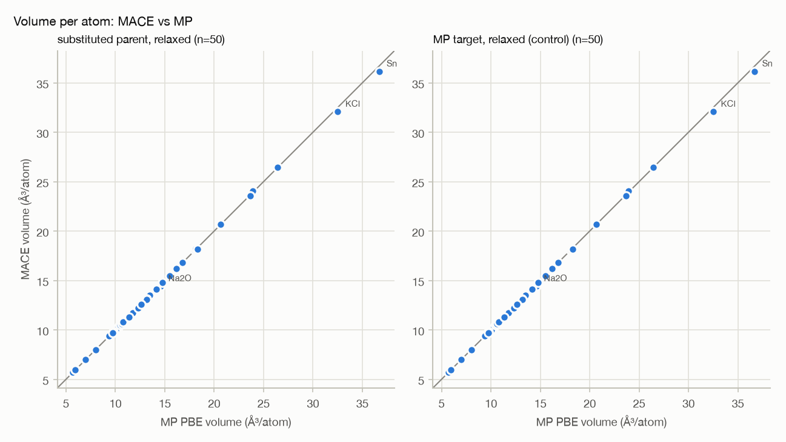
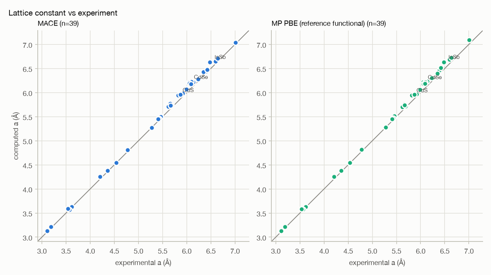
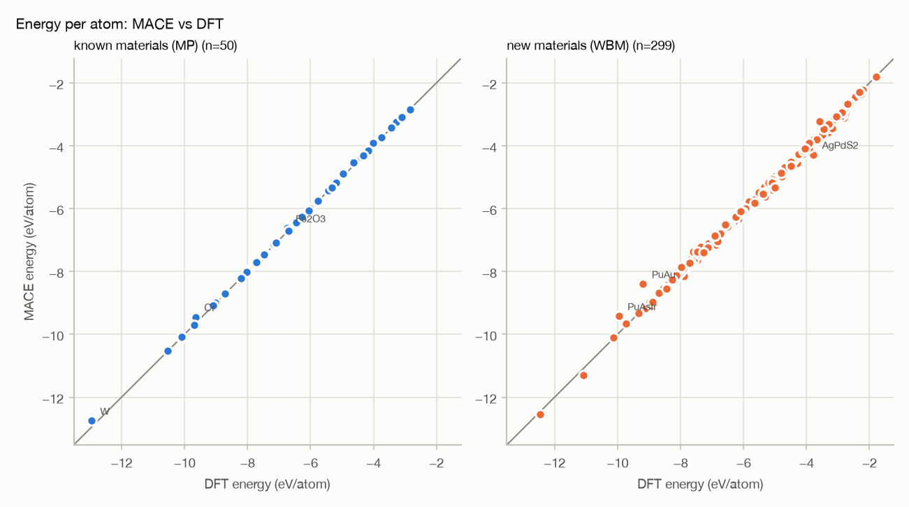
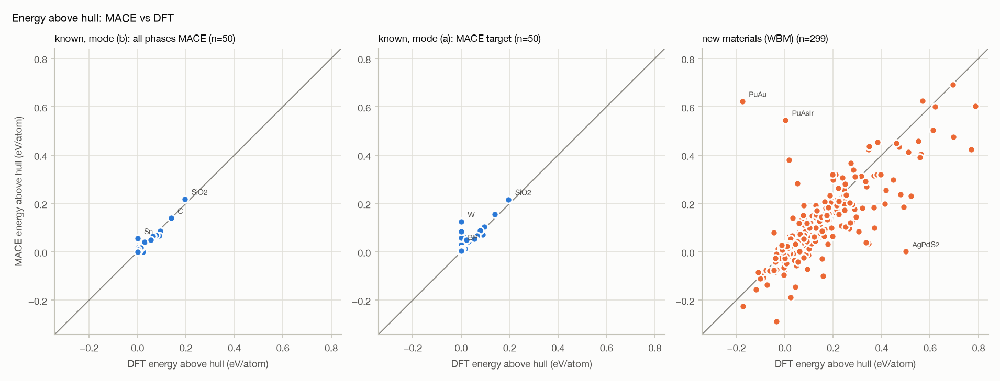
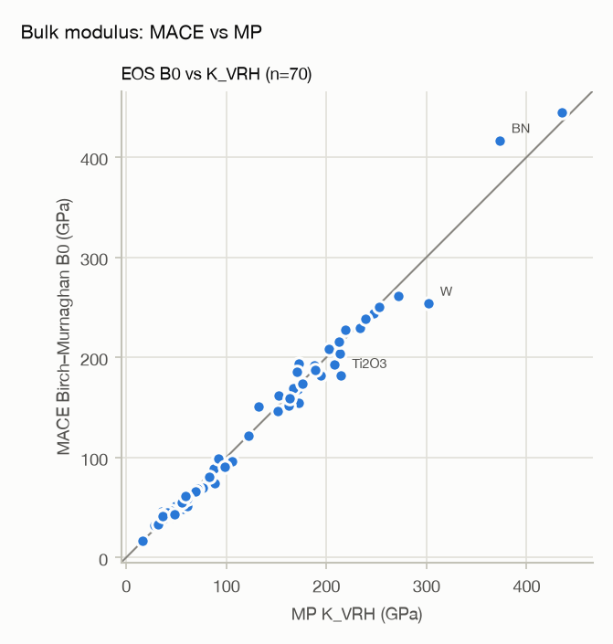
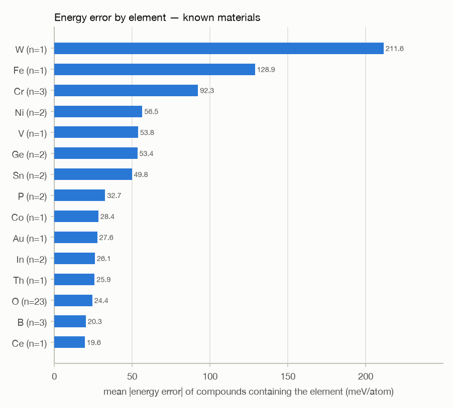
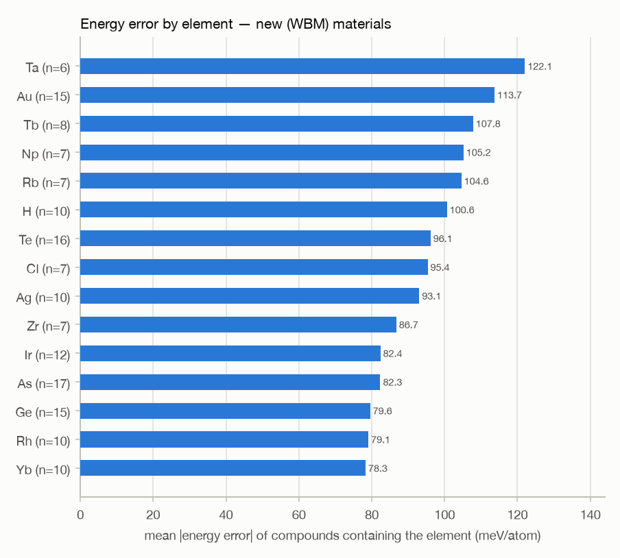
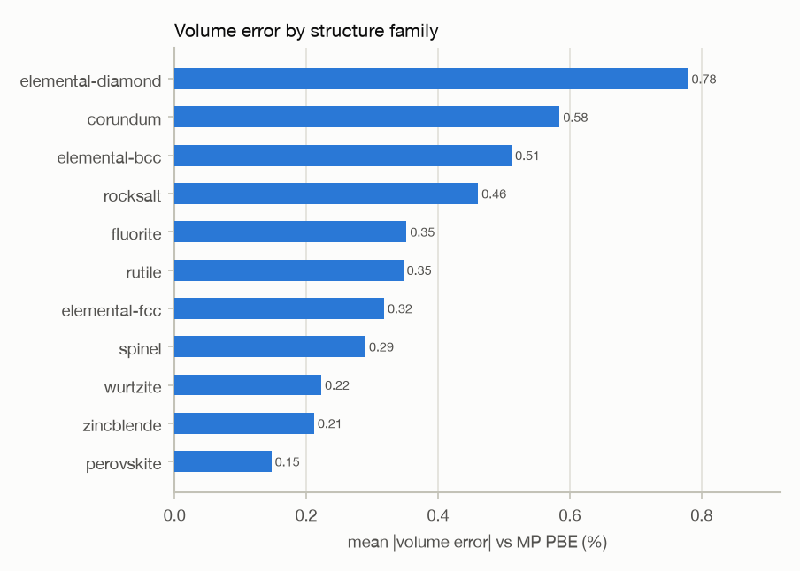

# Validation report — MACE-MP-0 medium

Generated 2026-09-10 22:40 UTC · commit `1897cf1` · settings tag `207ccc81` · model `2023-12-03-mace-128-L1_epoch-199.model` (sha256 `01bfe2210013…`) · cpu/float64 · Apple M4 Max (10 performance + 4 efficiency cores, 36.0 GB) · macOS 26.6.2

Relaxation: FrechetCellFilter + BFGS, fmax 0.01 eV/Å, max |stress| 0.01 GPa, ≤ 500 steps, 900 s timeout. Every number below comes from this settings tag only; references are Materials Project PBE/PBE+U (`GGA_GGA+U`), WBM DFT, or cited experiment. Brackets are bootstrap 95 % confidence intervals.

## Scorecard — is this engine trustworthy?

| Question                                              | Result                                                        | Verdict                                                                             |
|:------------------------------------------------------|:--------------------------------------------------------------|:------------------------------------------------------------------------------------|
| Structure / geometry vs its training functional (PBE) | volume error 0.37 [0.28, 0.47] % (n=50)                       | trustworthy                                                                         |
| Lattice constants vs experiment (room temperature)    | MACE +1.16 % vs PBE +1.23 % (n=33); MACE − PBE -0.07 %        | reproduces PBE (trustworthy); inherits PBE's ~+1 % overestimate                     |
| Energies — known (Materials Project) materials        | MAE 29.3 [18.4, 42.8] meV/atom (n=50)                         | trustworthy (borderline: 95 % CI spans 'trustworthy' to 'use with caution')         |
| Energies — genuinely new (WBM) materials              | MAE 61.5 [52.2, 71.9] meV/atom (n=299)                        | not trustworthy (borderline: 95 % CI spans 'use with caution' to 'not trustworthy') |
| Stability, all phases computed with MACE (mode b)     | e_hull MAE 4.4 meV/atom; accuracy@0.1 1.00 (n=50)             | trustworthy                                                                         |
| Stability, MACE target among DFT competitors (mode a) | e_hull MAE 15.4 meV/atom; accuracy@0.1 0.94                   | trustworthy                                                                         |
| Stability on new materials (WBM, mode a construction) | e_hull MAE 61.5 meV/atom; accuracy@0.1 0.81; precision@0 0.66 | use with caution                                                                    |
| Bulk modulus vs MP elastic K_VRH                      | MAE 6.4 [5.2, 7.8] % (n=70)                                   | trustworthy                                                                         |

**In plain language.**

* **Geometry is the engine's strongest point.** Relaxed volumes land within 0.37 % of the DFT it was trained on, across all 11 structure families, and symmetric substitutions always relax into the intended structure.
* **Against real measurements it is ~1.2 % too large — exactly as wrong as PBE itself (+1.23 %).** The model adds essentially no error of its own; the remaining gap is the DFT functional. Correct lattice constants by ~1 % before comparing to lab data.
* **Energies are about 2.1× worse on genuinely new materials** (62 vs 29 meV/atom), and the bias flips sign: on known materials MACE sits +28 meV/atom high, on new ones -27 meV/atom low — it *over-stabilises* new candidates. Treat every 'stable' call on a new material as a hypothesis, not a result.
* **Stability screening works best when every competing phase is also computed with MACE** (mode b: 4.4 vs 15.4 meV/atom), because the model's per-element offsets cancel. Use a 0.1 eV/atom tolerance, not 0: a strict on-hull test flips on errors of a few tens of meV/atom.
* **On new materials, about 34% of 'stable' calls are wrong** (precision 0.66 at 0 eV/atom). That is the number to weigh against the cost of a lab test.
* **Least trustworthy:** f-electron compounds (Np, Pu, Tb, Yb among the 20 worst new materials); magnetic systems (Cr2O3 +42, Fe2O3 +129, V2O3 +54, Cr +202, MgCr2O4 +32, NiO +86 meV/atom); elemental Cr, Sn, W, Ge energies (88–212 meV/atom off). MACE has no spin; these are reported separately below.
* **Not yet validated against experiment:** metals and oxides (the experimental set is semiconductors and insulators), temperature, and anything space-environment-specific (radiation, thermal cycling).

### By material family (in-distribution)

| family            |   n |   volume MAE % |   energy MAE meV/atom | rattled keeps structure   |   stability acc@0.1 (b) |   bulk MAE % | verdict                                       |
|:------------------|----:|---------------:|----------------------:|:--------------------------|------------------------:|-------------:|:----------------------------------------------|
| corundum          |   5 |           0.58 |                 53.68 | 80%                       |                    1.00 |        15.26 | geometry trustworthy; energy use with caution |
| elemental-bcc     |   3 |           0.51 |                143.15 | 100%                      |                    1.00 |         9.33 | geometry trustworthy; energy not trustworthy  |
| elemental-diamond |   3 |           0.78 |                 67.11 | 67%                       |                    1.00 |        13.65 | geometry trustworthy; energy not trustworthy  |
| elemental-fcc     |   3 |           0.32 |                 14.25 | 100%                      |                    1.00 |         0.70 | geometry trustworthy; energy trustworthy      |
| fluorite          |   6 |           0.35 |                 15.96 | 83%                       |                    1.00 |         4.19 | geometry trustworthy; energy trustworthy      |
| perovskite        |   6 |           0.15 |                  7.29 | 33%                       |                    1.00 |         2.60 | geometry trustworthy; energy trustworthy      |
| rocksalt          |   7 |           0.46 |                 19.38 | 100%                      |                    1.00 |         3.20 | geometry trustworthy; energy trustworthy      |
| rutile            |   4 |           0.35 |                 10.37 | 100%                      |                    1.00 |         4.02 | geometry trustworthy; energy trustworthy      |
| spinel            |   4 |           0.29 |                 15.48 | 100%                      |                    1.00 |         2.51 | geometry trustworthy; energy trustworthy      |
| wurtzite          |   5 |           0.22 |                 12.15 | 100%                      |                    1.00 |         6.03 | geometry trustworthy; energy trustworthy      |
| zincblende        |   4 |           0.21 |                 21.29 | 100%                      |                    1.00 |         5.05 | geometry trustworthy; energy trustworthy      |

Verdict thresholds: volume ≤ 1.0 % trustworthy, ≤ 2.0 % caution; energy ≤ 30 meV/atom trustworthy, ≤ 60 caution; stability accuracy ≥ 0.9 trustworthy; bulk ≤ 10 % trustworthy.

## Parity plots

*Volume per atom (substitution suite). Grey line: perfect agreement.*

*Room-temperature and 0 K-extrapolated lattice constants (Lucero et al. 2012). MACE and PBE sit together above the line: the offset is the functional.*

*Raw MACE vs uncorrected DFT energies. Known materials: MP control relaxations; new materials: 300 random WBM unique prototypes.*

*Energy above the convex hull. Mode (b) = all competing phases also computed with MACE.*

*Equation-of-state bulk modulus vs MP elastic K_VRH (fits with rms ≤ 1 meV/atom).*

## Errors by element and by structure family

**Known materials (MP control relaxations), energy error attributed to every element in the compound:**

| element   |   n |   MAE meV/atom |   mean meV/atom |
|:----------|----:|---------------:|----------------:|
| W         |   1 |          211.6 |           211.6 |
| Fe        |   1 |          128.9 |           128.9 |
| Cr        |   3 |           92.3 |            92.3 |
| Ni        |   2 |           56.5 |            56.5 |
| V         |   1 |           53.8 |            53.8 |
| Ge        |   2 |           53.4 |            53.4 |
| Sn        |   2 |           49.8 |            49.8 |
| P         |   2 |           32.7 |            32.7 |
| Co        |   1 |           28.4 |            28.4 |
| Au        |   1 |           27.6 |            27.6 |
| In        |   2 |           26.1 |            26.1 |
| Th        |   1 |           25.9 |            25.9 |
| O         |  23 |           24.4 |            22.5 |
| B         |   3 |           20.3 |            20.3 |
| Ce        |   1 |           19.6 |            19.6 |
| Be        |   1 |           16.4 |            16.4 |
| Cl        |   1 |           15.8 |            15.8 |
| Nb        |   1 |           15.5 |            15.5 |
| K         |   4 |           13.6 |            13.6 |
| N         |   5 |           13.0 |            13.0 |

**New materials (WBM), elements appearing in ≥ 5 sampled compounds:**

| element   |   n |   MAE meV/atom |   mean meV/atom |
|:----------|----:|---------------:|----------------:|
| Ta        |   6 |          122.1 |          -116.4 |
| Au        |  15 |          113.7 |            23.2 |
| Tb        |   8 |          107.8 |           -91.6 |
| Np        |   7 |          105.2 |            34.5 |
| Rb        |   7 |          104.6 |           -79.8 |
| H         |  10 |          100.6 |           -97.4 |
| Te        |  16 |           96.1 |           -26.4 |
| Cl        |   7 |           95.4 |           -95.4 |
| Ag        |  10 |           93.1 |           -83.5 |
| Zr        |   7 |           86.7 |           -75.5 |
| Ir        |  12 |           82.4 |            41.6 |
| As        |  17 |           82.3 |            11.2 |
| Ge        |  15 |           79.6 |           -69.6 |
| Rh        |  10 |           79.1 |           -25.2 |
| Yb        |  10 |           78.3 |             2.6 |
| Cr        |   7 |           75.5 |            10.9 |
| Sn        |  24 |           74.4 |           -66.8 |
| I         |   6 |           72.9 |           -58.0 |
| S         |  16 |           72.5 |           -50.9 |
| Mg        |  14 |           72.4 |           -61.3 |

**By structure family (MP control relaxations):**

| family            |   n |   volume MAE % |   lattice MAE % |   energy MAE meV/atom |
|:------------------|----:|---------------:|----------------:|----------------------:|
| elemental-diamond |   3 |           0.78 |            0.26 |                 67.11 |
| corundum          |   5 |           0.58 |            0.96 |                 53.68 |
| elemental-bcc     |   3 |           0.51 |            0.17 |                143.15 |
| rocksalt          |   7 |           0.46 |            0.15 |                 19.38 |
| fluorite          |   6 |           0.35 |            0.12 |                 15.96 |
| rutile            |   4 |           0.35 |            0.28 |                 10.37 |
| elemental-fcc     |   3 |           0.32 |            0.11 |                 14.25 |
| spinel            |   4 |           0.29 |            0.10 |                 15.48 |
| wurtzite          |   5 |           0.22 |            0.21 |                 12.15 |
| zincblende        |   4 |           0.21 |            0.07 |                 21.29 |
| perovskite        |   6 |           0.15 |            0.05 |                  7.29 |

## The 10 worst cases

Ranked by absolute energy error against DFT (energy is what drives every stability call), across known and new materials. Likely causes are assigned by fixed rules from the composition and flags, not by hand.

| case                     | set       |   energy error meV/atom | likely cause                                                                                                                        |
|:-------------------------|:----------|------------------------:|:------------------------------------------------------------------------------------------------------------------------------------|
| PuAu (wbm-1-3935)        | new (WBM) |                   798.7 | f-electron chemistry (Pu): no explicit spin or strong correlation in MACE; out-of-distribution composition/prototype (not in MPtrj) |
| PuAsIr (wbm-3-6465)      | new (WBM) |                   542.6 | f-electron chemistry (Pu): no explicit spin or strong correlation in MACE; out-of-distribution composition/prototype (not in MPtrj) |
| AgPdS2 (wbm-3-63735)     | new (WBM) |                  -498.7 | out-of-distribution composition/prototype (not in MPtrj)                                                                            |
| YbTe2 (wbm-5-21520)      | new (WBM) |                   362.5 | f-electron chemistry (Yb): no explicit spin or strong correlation in MACE; out-of-distribution composition/prototype (not in MPtrj) |
| TaZnSn (wbm-4-40004)     | new (WBM) |                  -346.4 | out-of-distribution composition/prototype (not in MPtrj)                                                                            |
| Zr(BeGe)2 (wbm-2-6661)   | new (WBM) |                  -311.8 | out-of-distribution composition/prototype (not in MPtrj)                                                                            |
| Te(PbCl3)2 (wbm-1-10765) | new (WBM) |                  -305.7 | out-of-distribution composition/prototype (not in MPtrj)                                                                            |
| Tb2SiGe (wbm-5-20364)    | new (WBM) |                  -298.5 | f-electron chemistry (Tb): no explicit spin or strong correlation in MACE; out-of-distribution composition/prototype (not in MPtrj) |
| Mn2SnPt (wbm-4-20769)    | new (WBM) |                  -290.6 | out-of-distribution composition/prototype (not in MPtrj)                                                                            |
| ScFe5 (wbm-1-51659)      | new (WBM) |                  -271.4 | out-of-distribution composition/prototype (not in MPtrj)                                                                            |

The overall ten are all new materials; the five worst **known** materials, so their failures stay visible:

| case                | set        |   energy error meV/atom | likely cause                                                                                                      |
|:--------------------|:-----------|------------------------:|:------------------------------------------------------------------------------------------------------------------|
| W (mp-aaaaaadn)     | known (MP) |                   211.6 | systematic elemental energy offset (see per-element table)                                                        |
| Cr (mp-aaaaaadm)    | known (MP) |                   202.4 | magnetic in DFT (MACE has no spin degrees of freedom); systematic elemental energy offset (see per-element table) |
| Fe2O3 (mp-aaaabdgk) | known (MP) |                   128.9 | magnetic in DFT (MACE has no spin degrees of freedom)                                                             |
| Ge (mp-aaaaaabg)    | known (MP) |                    97.2 | systematic elemental energy offset (see per-element table)                                                        |
| Sn (mp-aaaaaaen)    | known (MP) |                    88.3 | systematic elemental energy offset (see per-element table)                                                        |

**Other notable failures:**

* **Al2O3->V2O3 (symmetry-broken start):** lower symmetry, not lower energy (SG 2), -0.9 meV/atom vs the relaxed MP structure. Symmetry lowered with no energy change (numerically flat).
* **CaF2->HfO2 (symmetry-broken start):** distorts to lower energy (SG 14), -65.4 meV/atom vs the relaxed MP structure. A lower-energy distortion of an unstable high-symmetry target — physically right.
* **Si->C (symmetry-broken start):** lower symmetry, not lower energy (SG 65), +182.5 meV/atom vs the relaxed MP structure. Trapped above the target: a genuine failure mode for large size mismatches.
* **SrTiO3->BaTiO3 (symmetry-broken start):** distorts to lower energy (SG 38), -9.3 meV/atom vs the relaxed MP structure. A lower-energy distortion of an unstable high-symmetry target — physically right.
* **SrTiO3->CaTiO3 (symmetry-broken start):** distorts to lower energy (SG 62), -63.5 meV/atom vs the relaxed MP structure. A lower-energy distortion of an unstable high-symmetry target — physically right.
* **SrTiO3->KTaO3 (symmetry-broken start):** lower symmetry, not lower energy (SG 160), -0.3 meV/atom vs the relaxed MP structure. Symmetry lowered with no energy change (numerically flat).
* **SrTiO3->SrZrO3 (symmetry-broken start):** distorts to lower energy (SG 62), -49.5 meV/atom vs the relaxed MP structure. A lower-energy distortion of an unstable high-symmetry target — physically right.
* **8 competing-phase relaxations were rejected** by the convergence / physical-sanity guard and left out of the mode (b) hulls: mp-aaaaatej (not converged), mp-aaacsvqv (not converged), mp-aaacsvsd (not converged), mp-aaacsvwf (not converged), mp-aaacsvxp (not converged), mp-aaacsvyq (not converged), mp-aaacsvzs (not converged), mp-aaacswcw (not converged). One of these (solid O₂) had collapsed to 0.07 Å at −1.2×10¹¹ eV/atom before the guard existed.
* **Rejected new-material relaxations:** Np2Hg (wbm-2-22146: not converged)

## Magnetic, transition-metal and f-electron systems (reported separately)

MACE-MP-0 has no spin degrees of freedom. These systems are excluded from nothing, but their numbers are split out.

| group          |   n |   volume MAE % |   energy MAE meV/atom |
|:---------------|----:|---------------:|----------------------:|
| no spin caveat |  38 |           0.38 |                 15.81 |
| spin caveat    |  12 |           0.34 |                 72.13 |

| pair_id          | family        | magnetic   | transition_metal   | f_electron   |   volume err % |   energy err meV/atom |
|:-----------------|:--------------|:-----------|:-------------------|:-------------|---------------:|----------------------:|
| Al2O3->Cr2O3     | corundum      | True       | True               | False        |          -0.36 |                 42.50 |
| Al2O3->Fe2O3     | corundum      | True       | True               | False        |           0.95 |                128.90 |
| Al2O3->V2O3      | corundum      | True       | True               | False        |          -0.60 |                 53.80 |
| CaF2->CeO2       | fluorite      | False      | False              | True         |           0.03 |                 19.58 |
| CaF2->ThO2       | fluorite      | False      | False              | True         |           0.03 |                 25.88 |
| Fe->Cr           | elemental-bcc | True       | True               | False        |          -0.80 |                202.36 |
| KMgF3->KNiF3     | perovskite    | True       | True               | False        |           0.26 |                 26.56 |
| MgAl2O4->CoAl2O4 | spinel        | True       | True               | False        |           0.18 |                 28.36 |
| MgAl2O4->MgCr2O4 | spinel        | True       | True               | False        |           0.64 |                 32.14 |
| MgO->NiO         | rocksalt      | True       | True               | False        |           0.03 |                 86.50 |
| Mo->W            | elemental-bcc | False      | True               | False        |           0.10 |                211.57 |
| Ni->Pd           | elemental-fcc | True       | True               | False        |           0.06 |                 -7.43 |

**Stability gate, split by spin caveat:**

| group                        | mode   |   n |   e_hull MAE meV/atom |   accuracy@0 |   accuracy@0.1 |
|:-----------------------------|:-------|----:|----------------------:|-------------:|---------------:|
| no spin caveat               | a      |  38 |                  9.90 |         0.71 |           0.97 |
| no spin caveat               | b      |  38 |                  4.59 |         0.92 |           1.00 |
| spin caveat (target or hull) | a      |  12 |                 33.00 |         0.58 |           0.83 |
| spin caveat (target or hull) | b      |  12 |                  3.61 |         0.67 |           1.00 |

**New materials (WBM), split by spin caveat:**

| group          |   n |   energy MAE meV/atom |   precision@0 |   recall@0 |   F1@0 |
|:---------------|----:|----------------------:|--------------:|-----------:|-------:|
| no spin caveat |  85 |                 70.10 |          0.53 |       0.71 |   0.61 |
| spin caveat    | 214 |                 58.10 |          0.73 |       0.75 |   0.74 |

## Out-of-distribution score next to the in-distribution score

MACE-MP-0 was trained on Materials Project data, so MP-based scores overstate accuracy on new materials. The WBM sample (300 random structures from the 215,488 unique-prototype set, seed 20260910, ids in `data/ood_wbm_sample.json`) was never in its training data. **These two columns are never averaged together.**

| metric                                                           | known materials (MP)   | new materials (WBM)   |
|:-----------------------------------------------------------------|:-----------------------|:----------------------|
| energy MAE (meV/atom)                                            | 29.3 [18.4, 42.8]      | 61.5 [52.2, 71.9]     |
| mean signed energy error (meV/atom)                              | +27.7 [+16.5, +41.3]   | -27.2 [-38.7, -15.0]  |
| energy above hull MAE (meV/atom), MACE target vs DFT competitors | 15.4                   | 61.5                  |
| stable-call precision / recall @ 0 eV/atom                       | 0.95 / 0.57            | 0.66 / 0.74           |
| F1 @ 0 eV/atom                                                   | —                      | 0.70                  |
| n                                                                | 50                     | 299                   |

For WBM the hull distance is DFT hull distance + (MACE − DFT energy), the Matbench Discovery construction, so its error equals the energy error by design. Cross-check: Matbench Discovery reports F1 = 0.669 for MACE-MP-0 on the full unique-prototype set (FIRE, fmax 0.05); this sample's F1 is consistent with it.

## Experimental check

Reference: Lucero, Henderson & Scuseria, *J. Phys.: Condens. Matter* **24**, 145504 (2012), Table I (doi:10.1088/0953-8984/24/14/145504). 33 room-temperature values score the headline; 6 values the source gives as uncorrected 0 K extrapolations are shown separately; β-GaN was not run (ambiguous structure in the source). **Coverage gap: no metals and one oxide.**

| set              |   n |   MACE vs exp mean % |   MACE vs exp MAE % |   PBE vs exp mean % |   MACE − PBE mean % |
|:-----------------|----:|---------------------:|--------------------:|--------------------:|--------------------:|
| room temperature |  33 |                 1.16 |                1.16 |                1.23 |               -0.07 |
| 0 K extrapolated |   6 |                 0.96 |                0.96 |                1.04 |               -0.07 |

| material   | structure   | status   |   a_exp |   a_mace |   a_pbe |   a_err_pct |   a_pbe_err_pct |   a_mace_vs_pbe_pct |
|:-----------|:------------|:---------|--------:|---------:|--------:|------------:|----------------:|--------------------:|
| CdSe       | zb          | rt       |   6.052 |    6.217 |   6.213 |       2.730 |           2.658 |               0.070 |
| InSb       | zb          | rt       |   6.479 |    6.633 |   6.633 |       2.370 |           2.380 |              -0.010 |
| CdS        | zb          | rt       |   5.818 |    5.945 |   5.941 |       2.187 |           2.111 |               0.074 |
| InAs       | zb          | rt       |   6.058 |    6.190 |   6.181 |       2.177 |           2.038 |               0.136 |
| CdTe       | zb          | rt       |   6.480 |    6.618 |   6.629 |       2.137 |           2.300 |              -0.160 |
| GaSb       | zb          | rt       |   6.096 |    6.223 |   6.219 |       2.080 |           2.019 |               0.061 |
| Ge         | di          | zero_k   |   5.658 |    5.773 |   5.763 |       2.036 |           1.853 |               0.179 |
| GaAs       | zb          | zero_k   |   5.648 |    5.741 |   5.750 |       1.643 |           1.809 |              -0.163 |
| MgS        | zb          | rt       |   5.622 |    5.711 |   5.698 |       1.583 |           1.354 |               0.226 |
| InP        | zb          | rt       |   5.869 |    5.959 |   5.957 |       1.534 |           1.495 |               0.039 |
| ZnTe       | zb          | rt       |   6.089 |    6.181 |   6.185 |       1.505 |           1.574 |              -0.068 |
| InN        | wu          | rt       |   3.537 |    3.587 |   3.584 |       1.406 |           1.325 |               0.079 |
| AlSb       | zb          | rt       |   6.136 |    6.220 |   6.234 |       1.376 |           1.593 |              -0.214 |
| SrS        | rs          | rt       |   5.990 |    6.071 |   6.063 |       1.347 |           1.226 |               0.120 |
| CaTe       | rs          | rt       |   6.348 |    6.430 |   6.397 |       1.294 |           0.775 |               0.514 |
| AlAs       | zb          | rt       |   5.661 |    5.729 |   5.734 |       1.209 |           1.285 |              -0.075 |
| ZnSe       | zb          | rt       |   5.668 |    5.736 |   5.742 |       1.193 |           1.312 |              -0.117 |
| MgO        | rs          | zero_k   |   4.207 |    4.254 |   4.256 |       1.128 |           1.176 |              -0.048 |
| GaP        | zb          | rt       |   5.451 |    5.512 |   5.506 |       1.121 |           1.014 |               0.105 |
| CaSe       | rs          | rt       |   5.916 |    5.981 |   5.965 |       1.101 |           0.822 |               0.276 |
| SrTe       | rs          | rt       |   6.640 |    6.712 |   6.724 |       1.085 |           1.267 |              -0.180 |
| AlP        | zb          | rt       |   5.463 |    5.516 |   5.507 |       0.968 |           0.807 |               0.159 |
| MgTe       | zb          | rt       |   6.420 |    6.475 |   6.513 |       0.852 |           1.443 |              -0.582 |
| BaSe       | rs          | rt       |   6.595 |    6.648 |   6.687 |       0.803 |           1.389 |              -0.578 |
| BaS        | rs          | rt       |   6.389 |    6.437 |   6.457 |       0.757 |           1.068 |              -0.307 |
| CaS        | rs          | rt       |   5.689 |    5.732 |   5.716 |       0.754 |           0.479 |               0.274 |
| SrSe       | rs          | rt       |   6.234 |    6.281 |   6.304 |       0.747 |           1.120 |              -0.369 |
| alpha-GaN  | wu          | rt       |   3.189 |    3.213 |   3.216 |       0.739 |           0.856 |              -0.116 |
| ZnS        | zb          | rt       |   5.409 |    5.447 |   5.450 |       0.710 |           0.763 |              -0.053 |
| MgSe       | rs          | rt       |   5.460 |    5.498 |   5.511 |       0.692 |           0.933 |              -0.239 |
| BAs        | zb          | rt       |   4.777 |    4.806 |   4.819 |       0.608 |           0.885 |              -0.274 |
| AlN        | wu          | rt       |   3.111 |    3.127 |   3.129 |       0.510 |           0.565 |              -0.055 |
| Si         | di          | zero_k   |   5.430 |    5.455 |   5.469 |       0.469 |           0.713 |              -0.242 |
| beta-SiC   | zb          | zero_k   |   4.358 |    4.376 |   4.380 |       0.417 |           0.495 |              -0.078 |
| BaTe       | rs          | rt       |   7.007 |    7.036 |   7.090 |       0.414 |           1.181 |              -0.758 |
| BN         | zb          | rt       |   3.616 |    3.626 |   3.626 |       0.273 |           0.277 |              -0.004 |
| C          | di          | zero_k   |   3.567 |    3.570 |   3.574 |       0.093 |           0.188 |              -0.094 |
| BSb        | zb          | rt       |   5.278 |    5.273 |   5.282 |      -0.086 |           0.083 |              -0.169 |
| BP         | zb          | rt       |   4.538 |    4.541 |   4.547 |       0.071 |           0.194 |              -0.123 |

## Bulk modulus

Birch–Murnaghan fits over 9 volumes (±4 %), cell shape relaxed at each volume, vs MP elastic K_VRH (the elasticity documents do not state the functional). 70 fitted, 0 flagged fits excluded from the MAE, 11 materials without an MP elasticity reference, 0 failed.

| group          |   n |   mean vs K_VRH % |   MAE vs K_VRH % |   MAE vs K_Reuss % |
|:---------------|----:|------------------:|-----------------:|-------------------:|
| all            |  70 |             -0.11 |             6.44 |               6.43 |
| no spin caveat |  65 |             -0.00 |             6.49 |               6.48 |
| spin caveat    |   5 |             -1.54 |             5.75 |               5.71 |

| label     | mp_id       | family            |   b0_gpa |   k_vrh |   k_reuss |   err_pct_vrh |   bp | anisotropic   | spin_caveat   |
|:----------|:------------|:------------------|---------:|--------:|----------:|--------------:|-----:|:--------------|:--------------|
| Sn        | mp-aaaaaaen | elemental-diamond |    45.60 |   35.86 |     35.86 |         27.18 | 4.77 | False         | False         |
| MgTe      | mp-aaaaathh | exp-zb            |    42.05 |   35.37 |     35.37 |         18.88 | 3.98 | False         | False         |
| CdTe      | mp-aaaaaapq | exp-zb            |    41.64 |   35.04 |     35.04 |         18.83 | 4.71 | False         | False         |
| Si        | mp-aaaaaaft | exp-di            |    74.63 |   88.92 |     88.92 |        -16.07 | 5.47 | False         | False         |
| W         | mp-aaaaaadn | elemental-bcc     |   253.94 |  302.26 |    302.26 |        -15.99 | 4.70 | False         | True          |
| GaAs      | mp-aaaaadtm | exp-zb            |    51.25 |   60.74 |     60.74 |        -15.63 | 5.10 | False         | False         |
| Ti2O3     | mp-aaaaaarq | corundum          |   181.68 |  214.39 |    213.63 |        -15.26 | 7.60 | False         | False         |
| BaTe      | mp-aaaaabmm | exp-rs            |    32.56 |   28.29 |     28.29 |         15.11 | 3.10 | False         | False         |
| BAs       | mp-aaaaaowi | exp-zb            |   150.48 |  131.93 |    131.93 |         14.06 | 5.21 | False         | False         |
| CaS       | mp-aaaaacmi | exp-rs            |    49.07 |   56.85 |     56.85 |        -13.68 | 4.25 | False         | False         |
| alpha-GaN | mp-aaaaabey | exp-wu            |   193.99 |  172.14 |    172.14 |         12.69 | 4.08 | False         | False         |
| InSb      | mp-aaaabdps | exp-zb            |    41.04 |   36.74 |     36.74 |         11.72 | 4.44 | False         | False         |
| Ge        | mp-aaaaaabg | elemental-diamond |    51.20 |   57.92 |     57.92 |        -11.60 | 3.65 | False         | False         |
| BN        | mp-aaaaadyb | wurtzite          |   416.75 |  373.49 |    373.48 |         11.58 | 3.37 | False         | False         |
| GaSb      | mp-aaaaabsm | exp-zb            |    39.72 |   44.79 |     44.79 |        -11.32 | 4.39 | False         | False         |

## Runtime on this Mac

| suite        |   structures |   median s/structure |   p90 s |   max s |   sum of per-structure s |
|:-------------|-------------:|---------------------:|--------:|--------:|-------------------------:|
| bulk         |           70 |                  0.5 |     2.8 |     8.2 |                     68.9 |
| experimental |           39 |                  0.3 |     0.6 |     1.1 |                     13.5 |
| ood          |          300 |                  1.5 |     5.7 |    23.0 |                    715.5 |
| smoke        |            1 |                  0.3 |     0.3 |     0.3 |                      0.3 |
| stability    |         1190 |                  5.6 |    57.4 |   813.9 |                  28037.1 |
| substitution |          150 |                  0.9 |    60.7 |   391.7 |                   4117.6 |

Per-structure times are single-worker wall times: 10 workers × 1 thread run concurrently (cells > 100 atoms on 2 × 5), so a suite's elapsed time is roughly the sum divided by the number of workers. Stability counts the 1,190 competing-phase relaxations (the 50 target evaluations reuse substitution energies). Bulk-modulus times cover all 9 equation-of-state points. MPS could not run this model (see `config/compute.json`: MPS/float32 could not run (3/3 structures failed: TypeError: Cannot convert a MPS Tensor to float64 dtype as the MPS framework doesn't support float64. Please use float32 instead.); CPU/float64 required.)

**Job outcomes (current settings):**

| suite        |   ok |   skipped |
|:-------------|-----:|----------:|
| bulk         |   70 |        11 |
| experimental |   39 |         1 |
| ood          |  300 |         0 |
| smoke        |    1 |         0 |
| stability    | 1240 |         0 |
| substitution |  150 |         0 |

## Method notes and fixes made along the way

* MP's summary endpoint now serves **r2SCAN** structures and energies for many materials (Ge: 5.675 Å, −13.87 eV/atom); every reference here comes from MP's PBE `GGA_GGA+U` thermo data (Ge: 5.763 Å, −4.62 eV/atom). MP ids are the new format (`mp-32` → `mp-aaaaaabg`).
* MP entries carry Element-keyed `oxidation_states`, which pymatgen's MP2020 correction looks up by symbol string; keys are normalised. The recomputed MP hull reproduces MP's stored energy above hull exactly for all 50 targets.
* FrechetCellFilter's fmax criterion let small cells stop with up to 0.19 GPa residual stress; an explicit max |stress| ≤ 0.01 GPa criterion was added (stricter, not looser).
* A physical-sanity guard rejects relaxations with atoms closer than 0.5 × the covalent-radius sum or that did not converge; rejections are counted, never silently dropped.
* mace-torch ≥ 0.3.10 defaults `mace_mp()` to MACE-MPA-0; the MACE-MP-0 medium checkpoint is loaded explicitly and pinned by SHA-256.
* No tolerance was loosened and no hard case was removed to improve a number.

## Files

* `results/results.sqlite` — every job and every structure × test row with provenance and settings
* `results/results.parquet` — the same results table (all settings tags; filter on `settings_tag`)
* `reports/figures/` — the plots above

